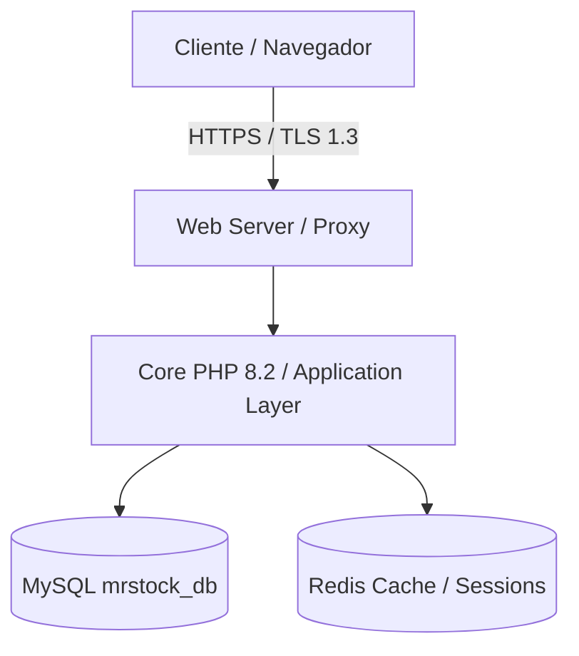

# GitHub Repository Architect

Estrutura, audita e provisiona repositórios profissionais no GitHub. Esta skill implementa governança como código, arquitetura de documentação Diátaxis, registros de decisão arquitetural (ADRs), segurança de cadeia de suprimentos (OpenSSF) e diretrizes de prontidão para agentes autônomos de IA (AI-Ready).

---

## ⚡ 1. Visão Geral & Princípios Técnicos

1. **BLUF (Bottom Line Up Front):** Toda infraestrutura de repositório deve ser declarada como código (`as-code`), determinística e autodocumentada.
2. **Imutabilidade da Branch Principal:** `main` é protegida. Nenhuma alteração entra sem Pull Request validado por CI, linter e code review.
3. **Isolamento de Domínio:** Organização por funcionalidade (*Package by Feature*) sobre organização por camadas genéricas (*Package by Layer*).
4. **Governança Estrita:** Sem issues ou PRs livres de formulário. O repositório impõe contratos via YAML templates e checklists obrigatórios.
5. **AI-Ready por Padrão:** O repositório deve ser navegável tanto por humanos quanto por agentes de IA, com arquivos `AGENTS.md` e roteamento progressivo de contexto.

---

## 📁 2. Estrutura Completa de Pastas (Padrão Enterprise)

```text
.
├── .devcontainer/                  # Ambiente reprodutível conteinerizado
│   ├── devcontainer.json           # Configuração de extensões e portas do VS Code / Antigravity
│   └── Dockerfile                  # Imagem base do container de desenvolvimento
├── .github/                        # Governança, CI/CD e automações GitHub
│   ├── ISSUE_TEMPLATE/
│   │   ├── bug_report.yml          # Formulário estruturado de relato de bugs
│   │   ├── config.yml              # Bloqueio de issues em branco e links úteis
│   │   └── feature_request.yml     # Formulário estruturado de proposta de features
│   ├── workflows/
│   │   ├── ci.yml                  # Pipeline de validação (build, test, lint)
│   │   ├── dependency-review.yml   # Auditoria de vulnerabilidades em dependências
│   │   └── scorecard.yml           # Auditoria OpenSSF Scorecard
│   ├── CODEOWNERS                  # Mapeamento de responsáveis por módulo
│   ├── dependabot.yml              # Atualizações automatizadas de pacotes e actions
│   └── PULL_REQUEST_TEMPLATE.md    # Checklist obrigatório de submissão de PR
├── docs/                           # Documentação canônica Diátaxis
│   ├── adr/                        # Architecture Decision Records (imutáveis)
│   │   └── 0001-record-architecture-decisions.md
│   ├── explanation/                # Artigos conceituais e arquitetura de fundo
│   ├── how-to/                     # Guias orientados a problemas práticos
│   ├── reference/                  # Especificações técnicas, APIs e esquemas
│   └── tutorials/                  # Tutoriais orientados ao onboarding passo a passo
├── src/                            # Código-fonte da aplicação (Package by Feature)
│   ├── Core/                       # Infraestrutura compartilhada transversal
│   └── Modules/                    # Módulos de domínio de negócio isolados
├── tests/                          # Suíte de testes automatizados
│   ├── e2e/                        # Testes end-to-end de ponta a ponta
│   ├── integration/                # Testes de integração (Banco, APIs, Mensageria)
│   └── unit/                       # Testes unitários puros
├── tools/                          # Scripts operacionais, linters e git hooks
│   └── pre-commit                  # Hook de verificação sintática e secrets shield
├── .editorconfig                   # Padronização de formatação entre IDEs
├── .gitattributes                  # Normalização de EOL e regras do GitHub Linguist
├── .gitignore                      # Exclusão de artefatos efêmeros e segredos
├── AGENTS.md                       # Diretrizes operacionais e regras para coding agents
├── CHANGELOG.md                    # Histórico de alterações (Keep a Changelog)
├── LICENSE                         # Licença de uso de software (ex: MIT, Apache-2.0)
├── README.md                       # Visão geral, quickstart e arquitetura
└── SECURITY.md                     # Política de divulgação responsável de vulnerabilidades
```

---

## 🏛️ 3. Modelos Prontos de Governança GitHub

### 3.1. `.github/ISSUE_TEMPLATE/bug_report.yml`
```yaml
name: "Relato de Bug"
description: "Crie um relatório de falha reproduzível para ajudar a equipe a corrigir o problema."
title: "[Bug]: "
labels: ["bug", "triage"]
body:
  - type: markdown
    attributes:
      value: |
        Obrigado por relatar o problema. Forneça o máximo de detalhes operacionais para que possamos reproduzir a falha.
  - type: textarea
    id: description
    attributes:
      label: "Descrição do Problema"
      description: "Explicação clara e concisa do comportamento inesperado."
      placeholder: "Ao tentar finalizar a venda com desconto de 100%, o sistema retorna erro 500..."
    validations:
      required: true
  - type: textarea
    id: steps
    attributes:
      label: "Passos para Reproduzir"
      description: "Sequência determinística de ações para disparar a falha."
      placeholder: |
        1. Acesse a tela '/vendas/pdv.php'
        2. Adicione o item '001' ao carrinho
        3. Clique em 'Concluir Venda' sem informar forma de pagamento
    validations:
      required: true
  - type: textarea
    id: expected
    attributes:
      label: "Comportamento Esperado"
      description: "O que deveria ter acontecido segundo os requisitos."
      placeholder: "O sistema deve exibir um toast de aviso solicitando a seleção da forma de pagamento."
    validations:
      required: true
  - type: textarea
    id: logs
    attributes:
      label: "Logs e Rastreamento de Erro"
      description: "Stack trace, logs do console do navegador ou saída do terminal."
      render: shell
    validations:
      required: false
  - type: dropdown
    id: environment
    attributes:
      label: "Ambiente Afetado"
      options:
        - "Local / Desenvolvimento"
        - "Staging / Homologação"
        - "Produção"
    validations:
      required: true
  - type: checkboxes
    id: checklist
    attributes:
      label: "Checklist de Validação"
      options:
        - label: "Confirmo que não incluí senhas, chaves de API ou dados sensíveis neste reporte."
          required: true
        - label: "Verifiquei se já não existe uma issue aberta relatando o mesmo comportamento."
          required: true
```

### 3.2. `.github/ISSUE_TEMPLATE/feature_request.yml`
```yaml
name: "Proposta de Nova Funcionalidade"
description: "Sugira uma nova funcionalidade ou melhoria de arquitetura para o projeto."
title: "[Feature]: "
labels: ["enhancement"]
body:
  - type: markdown
    attributes:
      value: |
        Descreva detalhadamente a necessidade de negócio ou oportunidade técnica.
  - type: textarea
    id: problem
    attributes:
      label: "Problema ou Necessidade"
      description: "Qual problema essa funcionalidade resolve? Qual a dor do usuário?"
      placeholder: "Atualmente, o operador precisa digitar manualmente o código de barras de 13 dígitos quando o leitor falha..."
    validations:
      required: true
  - type: textarea
    id: solution
    attributes:
      label: "Solução Proposta"
      description: "Como a funcionalidade deve se comportar tecnicamente."
      placeholder: "Adicionar busca incremental por nome do produto com debounce de 250ms na topbar do PDV..."
    validations:
      required: true
  - type: textarea
    id: alternatives
    attributes:
      label: "Alternativas Consideradas"
      description: "Outras abordagens avaliadas e por que foram descartadas."
    validations:
      required: false
  - type: checkboxes
    id: scope
    attributes:
      label: "Impacto Arquitetural"
      options:
        - label: "Esta funcionalidade exige alteração em tabelas de banco de dados (Migration necessária)."
        - label: "Esta funcionalidade introduz nova rota de API ou endpoint público."
        - label: "Esta funcionalidade altera contratos de UI/Design System."
```

### 3.3. `.github/ISSUE_TEMPLATE/config.yml`
```yaml
blank_issues_enabled: false
contact_links:
  - name: "Documentação Oficial"
    url: "https://github.com/mrcodingdev/mrstock-erp/tree/main/docs"
    about: "Consulte nossos manuais, guias e referências antes de abrir uma solicitação."
  - name: "Suporte de Segurança"
    url: "https://github.com/mrcodingdev/mrstock-erp/security/policy"
    about: "Para reportar vulnerabilidades críticas de segurança, use nosso canal privado."
```

### 3.4. `.github/PULL_REQUEST_TEMPLATE.md`
```markdown
## 📋 Descrição das Alterações
<!-- BLUF: Resuma em 1 ou 2 frases o que este PR realiza e por quê. -->

**Tipo de Mudança:**
- [ ] `feat`: Nova funcionalidade
- [ ] `fix`: Correção de defeito
- [ ] `refactor`: Refatoração sem alteração de comportamento externo
- [ ] `perf`: Melhoria de desempenho
- [ ] `test`: Adição ou ajuste de testes automatizados
- [ ] `docs`: Documentação técnica
- [ ] `chore`: Manutenção de dependências, build ou configurações

---

## 🔍 Contexto e Rastreabilidade
- **Issue Vinculada:** Closes #
- **Módulos Afetados:** `src/Modules/...`

---

## ✅ Checklist Operacional do Desenvolvedor
- [ ] O código adere estritamente aos padrões de tipagem e Clean Code da stack do projeto.
- [ ] Sintaxe e formatação validadas localmente sem avisos (`linter` / `php -l`).
- [ ] Testes unitários e de integração adicionados ou atualizados; cobertura mantida.
- [ ] Nenhuma credencial, token ou segredo hardcodado (conformidade Zero-Leak).
- [ ] Documentação técnica ou ADR atualizada caso tenha ocorrido mudança arquitetural.
- [ ] Sem quebra de compatibilidade com versões anteriores (*No Breaking Changes*) ou migration inclusa.

---

## 🧪 Evidências de Validação
<!-- Anexe saída de execução de testes no terminal ou capturas de tela das telas alteradas. -->
```shell
# Cole aqui o comando determinístico executado e o resultado obtido
```
```

### 3.5. `.github/dependabot.yml`
```yaml
version: 2
updates:
  # Rastreamento de dependências do GitHub Actions
  - package-ecosystem: "github-actions"
    directory: "/"
    schedule:
      interval: "weekly"
      day: "monday"
      time: "06:00"
      timezone: "America/Sao_Paulo"
    open-pull-requests-limit: 5
    labels:
      - "dependencies"
      - "devops"

  # Rastreamento de dependências PHP (Composer)
  - package-ecosystem: "composer"
    directory: "/"
    schedule:
      interval: "weekly"
      day: "monday"
      time: "06:30"
      timezone: "America/Sao_Paulo"
    open-pull-requests-limit: 10
    labels:
      - "dependencies"
      - "backend"

  # Rastreamento de dependências Node.js (NPM)
  - package-ecosystem: "npm"
    directory: "/"
    schedule:
      interval: "weekly"
      day: "monday"
      time: "07:00"
      timezone: "America/Sao_Paulo"
    open-pull-requests-limit: 10
    labels:
      - "dependencies"
      - "frontend"
```

### 3.6. `.github/CODEOWNERS`
```text
# Governança de Propriedade do Código (CODEOWNERS)
# Cada linha define um padrão de caminho e os engenheiros responsáveis pela aprovação compulsória.

# Responsáveis padrão por todo o repositório
*                   @mrcodingdev

# Governança de CI/CD, Workflows e Infraestrutura GitHub
/.github/           @mrcodingdev
/.devcontainer/     @mrcodingdev

# Documentação Canônica e Decisões de Arquitetura
/docs/              @mrcodingdev

# Módulos de Domínio Crítico (Finanças, Vendas e Banco de Dados)
/src/Modules/Financeiro/   @mrcodingdev
/src/Modules/Vendas/       @mrcodingdev
/database/                 @mrcodingdev
```

---

## ⚙️ 4. Modelos de Configuração Raiz

### 4.1. `.editorconfig`
```ini
root = true

[*]
charset = utf-8
end_of_line = lf
indent_style = space
indent_size = 4
insert_final_newline = true
trim_trailing_whitespace = true

[*.{yml,yaml,json}]
indent_size = 2

[*.md]
trim_trailing_whitespace = false

[Makefile]
indent_style = tab
```

### 4.2. `.gitattributes`
```gitattributes
# Normalização automática de quebras de linha para LF em qualquer SO
* text=auto eol=lf

# Tratamento estrito de arquivos binários
*.png binary
*.jpg binary
*.jpeg binary
*.gif binary
*.ico binary
*.pdf binary
*.docx binary
*.xlsx binary
*.woff binary
*.woff2 binary

# Identificação de linguagens e exclusão de bibliotecas em estatísticas do repositório
/vendor/**                  linguist-vendored
/node_modules/**            linguist-vendored
/docs/**                    linguist-documentation
/tests/**                   linguist-documentation
```

### 4.3. `.gitignore` Base
```gitignore
# ==============================================================================
# 1. AMBIENTE & SEGREDOS (CRÍTICO: NUNCA VERSIONAR)
# ==============================================================================
.env
.env.local
.env.*.local
*.pem
*.key
*.cert

# ==============================================================================
# 2. GERENCIADORES DE PACOTES & DEPENDÊNCIAS
# ==============================================================================
/vendor/
/node_modules/
npm-debug.log*
yarn-debug.log*
yarn-error.log*

# ==============================================================================
# 3. BUILDS, CACHES & TEMPORÁRIOS
# ==============================================================================
/dist/
/build/
/.cache/
/tmp/
/scratch/
*.log

# ==============================================================================
# 4. IDES, EDITORES & SISTEMAS OPERACIONAIS
# ==============================================================================
.idea/
.vscode/*
!.vscode/settings.json
!.vscode/tasks.json
!.vscode/launch.json
*.sublime-workspace
.DS_Store
Thumbs.db
Desktop.ini
```

---

## 📚 5. Padrão de Documentação Diátaxis & ADRs

### 5.1. Estrutura do Diretório `docs/`
O padrão **Diátaxis** divide a documentação em 4 propósitos técnicos distintos:
* **`docs/tutorials/` (Aprendizado):** Guias para iniciantes realizarem o onboarding no projeto do zero ao primeiro commit executável.
* **`docs/how-to/` (Resolução de Problemas):** Guias de receitas operacionais para tarefas específicas (ex: *Como rodar migrations*, *Como emitir nota de contingência*).
* **`docs/reference/` (Informação Pura):** Descrições técnicas exatas, schemas de tabelas, endpoints de API e contratos de classes.
* **`docs/explanation/` (Compreensão de Arquitetura):** Textos reflexivos que detalham o motivo das escolhas técnicas de design.

### 5.2. Template de ADR (`docs/adr/0001-record-architecture-decisions.md`)
```markdown
# 0001. Adoção de Architecture Decision Records (ADR)

* **Status:** Aceito
* **Data:** 2026-09-19
* **Decisores:** Equipe de Engenharia MrStock

## Contexto
Decisões técnicas complexas frequentemente perdem seu contexto histórico ao longo do tempo. Quando novos desenvolvedores ou agentes de IA entram no repositório, é difícil discernir os motivos pelos quais determinada arquitetura foi escolhida ou rejeitada, levando a discussões repetidas ou refatorações inadequadas.

## Decisão
Adotamos o padrão Michael Nygard de Architecture Decision Records (ADRs). Todas as decisões estruturais, adições de bibliotecas de infraestrutura, escolhas de banco de dados ou estratégias de autenticação serão registradas em arquivos Markdown sequenciais em `docs/adr/`.

## Consequências
### Positivas
* Trilha histórica permanente e versionada de decisões de design.
* Alinhamento rápido para novos engenheiros e agentes autônomos.
* Redução de debates circulares sobre temas já resolvidos.

### Negativas / Custos
* Exige disciplina compulsória no processo de Pull Request para redigir o ADR antes de introduzir mudanças de arquitetura.
```

### 5.3. Template de `README.md` Técnico Sem Slop
```markdown
# [Nome do Repositório]

> [Descrição técnica de 1 parágrafo direto ao ponto explicando a função do sistema, público-alvo e problema resolvido].

---

## ⚡ Quickstart

### Pré-requisitos
* PHP 8.2+
* Composer 2.7+
* MySQL 8.0+

### Instalação em 3 Passos
```shell
git clone https://github.com/usuario/repositorio.git
cd repositorio
composer install
cp .env.example .env
```

### Execução dos Testes
```shell
vendor/bin/phpunit tests/
```

---

## 🏛️ Arquitetura



---

## 🛠️ Comandos Operacionais

| Comando | Descrição |
| :--- | :--- |
| `composer test` | Executa a suíte completa de testes unitários |
| `composer lint` | Valida padrões de código via PHP_CodeSniffer |
| `composer format` | Formata o código conforme regras do PSR-12 |

---

## 📖 Documentação
Consulte a documentação completa em [`docs/`](docs/):
* [Tutoriais de Instalação](docs/tutorials/)
* [Guias Como-Fazer](docs/how-to/)
* [Especificações de API e Banco](docs/reference/)
* [Decisões de Arquitetura (ADRs)](docs/adr/)
```

### 5.4. Template de `SECURITY.md` Enxuto
```markdown
# Política de Segurança

## Versões Suportadas
Apenas as versões listadas abaixo recebem atualizações ativas de segurança:

| Versão | Suporte de Segurança |
| :--- | :--- |
| 2.2.x | :white_check_mark: Ativo |
| 2.1.x | :x: Encerrado |
| < 2.0 | :x: Encerrado |

## Relato de Vulnerabilidades
Para relatar uma vulnerabilidade de segurança:
1. **NUNCA abra uma issue pública.**
2. Utilize o recurso oficial **GitHub Private Vulnerability Reporting** na aba `Security` deste repositório.
3. Se preferir e-mail, envie para: `seguranca@mrstock.com.br`.

### SLA de Resposta
* **Confirmação inicial do relato:** até 48 horas úteis.
* **Avaliação de impacto e triagem:** até 5 dias úteis.
* **Disponibilização de patch / CVE:** até 15 dias corridos.
```

---

## 🤖 6. Diretrizes para Repositórios AI-Ready

### 6.1. O Arquivo `AGENTS.md` Canônico
Agentes de codificação operam melhor quando os limites do projeto estão explícitos. Crie um `AGENTS.md` na raiz:

```markdown
# Diretrizes Operacionais para Agentes de IA (AGENTS.md)

## 🎯 Escopo & Filosofia
Este repositório adota as 4 Leis de Karpathy:
1. Pense antes de codificar (inspecione contratos antes de editar).
2. Simplicidade primeiro (YAGNI estrito, sem abstrações prematuras).
3. Mudanças cirúrgicas (nunca reescreva código funcional adjacente).
4. Execução guiada por objetivos (prove o funcionamento com evidência empírica).

## 🗂️ Roteamento de Módulos (Context Routing)
- Backend & Regras de Negócio: `src/Modules/`
- Banco de Dados & Migrations: `database/migrations/`
- Frontend & Telas: `src/Views/` e `public/assets/css/`
- Testes: `tests/`

## ⚙️ Regras Inegociáveis de Engenharia
- **Sem Suposições:** Não presuma que um endpoint funciona sem executar o teste ou verificar o retorno de status code.
- **Zero Segredos:** Proibido hardcodar senhas, tokens ou dados de ambiente. Tudo vem de variáveis `.env`.
- **Validação Sintática Obrigatória:** Antes de submeter qualquer PR, execute `php -l [arquivo]` ou o linter do ecossistema.
- **Portões Executáveis:** Todo PR substancial deve cumprir os critérios do contrato de portões (`GATES.md`).
```

### 6.2. Regras de Isolamento de Contexto & Progressive Disclosure
1. **Context Boundary (Fronteira Estrita):** Agentes devem carregar apenas o diretório do módulo ativo. Nunca leia o projeto inteiro de uma vez; utilize ferramentas cirúrgicas (`read_note_lines`, grep direcionado).
2. **Deterministic Gates (`GATES.md`):** Exija que o agente declare os comandos de terminal determinísticos que atestam a entrega antes de solicitar aprovação de código.
3. **Erradicação de AI Slop em Commits:** Mensagens de commit de agentes devem ser enxutas, informando a intenção e a causa raiz no formato Conventional Commits, sem floreios narrativos.
