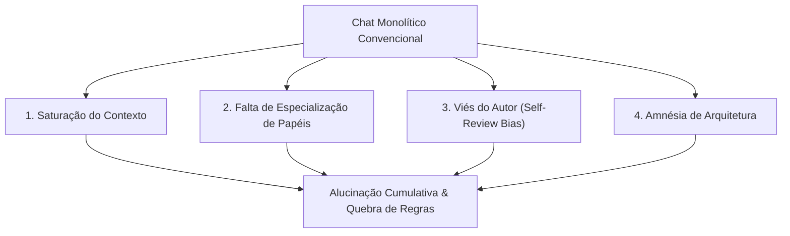
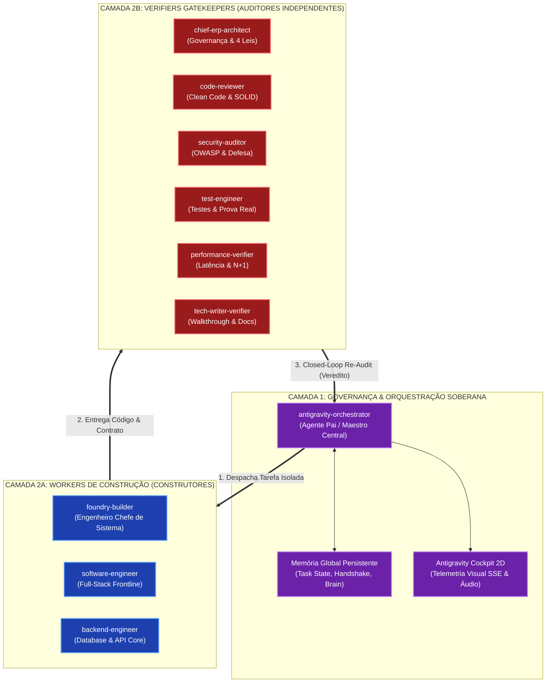
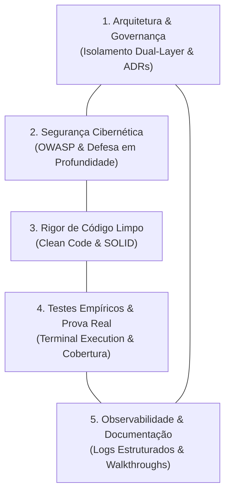

# 01. O Modelo Mental do Antigravity Foundry: Arquitetura Dual-Layer

> **Documento Oficial de Arquitetura de Referência**  
> **Versão:** 2.0.0 — Open Source Foundry Edition  
> **Classificação:** Arquitetura & Governança de Agentes Autônomos  

---

## 1. O Diagnóstico: Por que os Chats Convencionais de IA Colapsam

Em projetos de software reais e bases de código de grande porte, desenvolvedores frequentemente tentam utilizar assistentes de IA através de uma única sessão de chat contínuo. Esse padrão monolítico inevitavelmente entra em colapso devido a quatro falhas estruturais fundamentais:

1. **Saturação da Janela de Contexto (Context Bleed & Lost-in-the-Middle):**  
   À medida que o histórico de conversa ultrapassa dezenas de mensagens e milhares de linhas de código, modelos de linguagem sofrem de degradação de atenção. Instruções críticas definidas no início da sessão são esquecidas ou ignoradas.
2. **Falta de Isolamento de Responsabilidades (Layer Entanglement):**  
   Um único agente tentando pensar na arquitetura, escrever o CSS, criar o schema SQL, rodar testes e redigir a documentação ao mesmo tempo comete erros por dispersão cognitiva.
3. **O Viés do Autor (Self-Review Bias):**  
   O agente que escreve o código tende a declarar que o código está "perfeito" e "sem erros". Não há separação entre quem constrói e quem audita, resultando em falsos positivos desastrosos.
4. **Ausência de Portões Determinísticos (No Hard Gates):**  
   Em chats convencionais, o fechamento da tarefa é baseado em afirmações retóricas ("Pronto, implementei tudo com sucesso!") em vez de provas empíricas extraídas de comandos de terminal com exit code `0`.

---

## 2. A Solução: Arquitetura Dual-Layer do Antigravity Foundry

O **Antigravity Foundry** resolve o colapso cognitivo separando formalmente a orquestração da execução através de uma **Arquitetura Dual-Layer** (Camada Dupla):

### 2.1 Camada 1: Governança & Orquestração Soberana (Maestro Central)
- **Agente Responsável:** `antigravity-orchestrator` (Agente Pai).
- **Missão:** Centralizar o roadmap, planejar as sprints, quebrar tarefas em especificações formais, invocar os subagentes com contexto limpo e avaliar os vereditos dos auditores.
- **Princípio Sagrado:** O Maestro nunca escreve código de produção diretamente. Ele delega aos Workers e submete os entregáveis aos Verifiers antes de qualquer commit.

### 2.2 Camada 2: Execução Desacoplada e Especializada

#### A. Os 3 Workers de Construção (Execution Pipeline)
1. **`foundry-builder`:** O arquiteto construtor de elite. Constrói módulos de ponta a ponta, gerencia ambientes de infraestrutura, compilações e scripts de inicialização do ecossistema.
2. **`software-engineer`:** O especialista full-stack. Implementa interfaces, componentes reativos, regras de negócio front-end e integrações de consumo de API.
3. **`backend-engineer`:** O especialista de persistência e núcleo de dados. Escreve queries parametrizadas e seguras, gerencia transações ACID, locks concorrentes e controllers RESTful desacoplados.

#### B. Os 6 Verifiers Gatekeepers (Independent Audit Pipeline)
Nenhum código entra na base sem o crivo unânime de 6 auditores com papéis rigidamente segregados:
1. **`enterprise-architect`:** Garante conformidade com o Pentágono Sagrado de Governança, as 4 Leis de Karpathy e documenta novas decisões em ADRs.
2. **`code-reviewer`:** Impõe Clean Code, nomenclaturas autoexplicativas, limites de complexidade ciclomática e erradicação de código duplicado.
3. **`security-auditor`:** Avalia o código sob as diretrizes OWASP Top 10, sanitização rigorosa de inputs, imunidade a SQL Injection, XSS e quebra de controle de acesso (IDOR).
4. **`test-engineer`:** Valida que testes automatizados cobrem os cenários limites (edge cases) e que a prova real em terminal foi executada com êxito.
5. **`web-performance-auditor`:** Inspeciona planos de execução de queries (`EXPLAIN`), elimina consultas N+1 e audita Core Web Vitals e contenção de I/O.
6. **`anti-slop-ui-auditor`:** Assegura que interfaces respeitem o Design System Anti-Slop, acessibilidade WCAG 2.1 AA e contratos de handoff de interface.

---

## 3. O Pentágono Sagrado de Governança

O Antigravity Foundry estrutura a qualidade de software sobre 5 pilares inegociáveis, visualmente representados no Cockpit 2D como as 5 salas temáticas:

---

## 4. As 4 Leis Comportamentais de Andrej Karpathy

O Foundry traduz as melhores práticas de engenharia de Andrej Karpathy em leis operacionais mandatórias para todos os agentes:

1. **Lei 1: Think Before Coding (Pense Profundamente Antes de Codificar)**  
   *Proibido escrever qualquer linha de código sem antes formular uma especificação formal com Socratic Grill-Me e mapeamento exaustivo de casos de borda.*
2. **Lei 2: Simplicity First (Simplicidade Absoluta em Primeiro Lugar)**  
   *Elimine a complexidade acidental. Não instale bibliotecas externas volumosas para resolver problemas que duas funções puras e idiomáticas solucionam com elegância.*
3. **Lei 3: Surgical Precision (Precisão Cirúrgica)**  
   *Altere apenas os blocos de código estritamente necessários para a tarefa. Respeite as convenções vigentes, preservando contratos pré-existentes sem efeitos colaterais indesejados.*
4. **Lei 4: Goal-Driven Execution (Execução Orientada a Prova Real)**  
   *Nenhuma tarefa é dada por concluída sem a execução de comandos determinísticos no terminal (`npm test`, `php -l`, `curl`) comprovando o funcionamento prático com exit code `0`.*

---

## 5. Rastreabilidade & Telemetria em Tempo Real

A arquitetura se conecta de forma bidirecional com o ambiente do sistema operacional:
- Cada agente opera como uma sessão independente no diretório `.gemini/antigravity/brain/<session_id>/`.
- O **Agent Scanner** analisa periodicamente os logs estruturados (`transcript.jsonl`), capturando pensamentos profundos (Chain-of-Thought), ferramentas invocadas e status dos portões.
- Os eventos são despachados via **Server-Sent Events (SSE)** para o **Antigravity Cockpit**, proporcionando visibilidade instantânea de cada movimento do ecossistema em um ambiente pixel art dinâmico e interativo.
