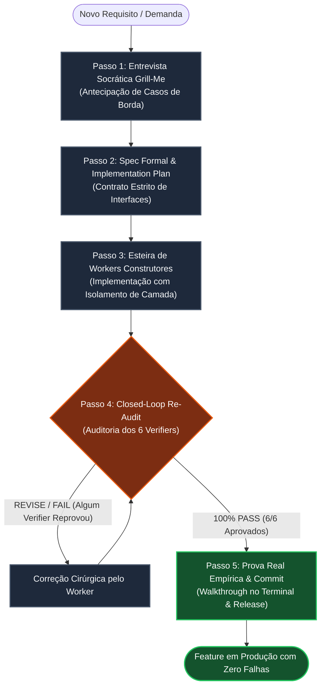

# 02. O Método Fundido em 5 Passos (The Gated SDLC)

> **Manual de Engenharia de Processo de Software**  
> **Framework:** Antigravity Gated Software Development Life Cycle  
> **Filosofia:** *Zero Regressões, Zero Alucinações, Prova Real Inegociável*  

---

## 1. Visão Geral do Fluxo em 5 Etapas

O **Método Fundido** é o ciclo de vida de desenvolvimento de software proprietário do Antigravity Foundry. Ao contrário dos processos ágeis tradicionais que toleram retrabalho e "bugs em produção", o Gated SDLC introduz portões determinísticos que impedem matematicamente que qualquer código defeituoso ou vulnerável avance no pipeline.



---

## 2. Passo 1: Entrevista Socrática Grill-Me (Hard Questioning)

### 2.1 Objetivo
Antes de planejar a implementação, o **Maestro** e o **Chief ERP Architect** submetem a demanda a um interrogatório socrático implacável. O objetivo é destruir suposições frágeis e mapear cenários de falha antes que eles custem horas de desenvolvimento.

### 2.2 As 5 Rodadas de Questionamento Obrigatório
1. **Concorrência & Conflito de Escrita:**
   - *O que ocorre se dois clientes executarem a mesma mutação concorrentemente?*
   - *Exigência:* Lock pessimista (`SELECT FOR UPDATE`) ou lock otimista com versionamento atômico.
2. **Falhas Parciais & Redes Degradadas:**
   - *Se a rede cair entre a escrita no banco e a emissão do webhook, como o sistema se comporta?*
   - *Exigência:* Transação ACID atômica ou padrão Outbox assíncrono com retry idempotente.
3. **Casos de Borda de Dados (Edge Cases):**
   - *Como o sistema lida com strings vazias, valores nulos, caracteres multibyte UTF-8, números negativos ou datas inválidas?*
   - *Exigência:* Dicionário estrito de validação na fronteira (Boundary Validation).
4. **Segurança & Controle de Acesso:**
   - *Um usuário com credencial válida consegue acessar o recurso de outro tenant alterando o ID na requisição (IDOR)?*
   - *Exigência:* Resolução de escopo no repositório vinculada à identidade validada do token.
5. **Reversibilidade & Rollback:**
   - *Se a alteração precisar ser desfeita em produção, a estrutura de banco de dados e as dependências permitem rollback sem perda de dados?*
   - *Exigência:* Migrações backward-compatible em padrão Expand-and-Contract.

---

## 3. Passo 2: Especificação Formal & Implementation Plan

### 3.1 Objetivo
Transformar o resultado da entrevista socrática em uma especificação técnica formal através do `implementation_plan.md`.

### 3.2 Componentes Obrigatórios do Plano
- **Problem Statement & Scope:** Diagnóstico da causa raiz, objetivos mensuráveis e fronteiras claras do que está dentro e fora de escopo.
- **Diagrama de Sequência Mermaid:** Mapeamento visual das mensagens trocadas entre UI, Router, Domain Service e Storage.
- **Contrato de Handoff Backend-to-Frontend:**
  - Tipagem estrita de payloads JSON (TypeScript / DTOs).
  - Códigos HTTP semânticos (200, 201, 400, 403, 404, 409, 422, 500).
  - Tabela com todos os códigos de erro de aplicação e mensagens visuais para a UI.
- **Checklist dos 6 Verifiers:** Critérios inegociáveis de aceite para cada um dos auditores.

---

## 4. Passo 3: Esteira de Workers com Relatório de Contrato

### 4.1 Objetivo
Executar a construção do código de forma isolada, limpa e focada exclusivamente no contrato estabelecido no Passo 2.

### 4.2 Alocação de Especialistas
- **`foundry-builder`:** Configuração de build, scripts de automação, pipelines e infraestrutura.
- **`software-engineer`:** Componentização visual, gerenciamento de estado na UI e chamadas de API.
- **`backend-engineer`:** Migrações DDL, domain services, queries PDO parametrizadas e controllers REST.

### 4.3 Regra de Imutabilidade de Contrato
O worker está expressamente proibido de alterar o contrato de handoff unilateralmente. Se durante a implementação for descoberta a necessidade de alterar campos ou endpoints:
1. O worker deve suspender o desenvolvimento.
2. Solicitar ao Maestro a revisão do `implementation_plan.md`.
3. Obter nova aprovação antes de retomar.

---

## 5. Passo 4: Closed-Loop Re-Audit (Auditoria dos 6 Verifiers)

### 5.1 O Mecanismo de Closed-Loop
Nenhuma entrega é aceita por autodeclaração. A entrega do worker é submetida simultaneamente aos 6 Verifiers Gatekeepers:

| Verifier | Foco da Auditoria | Critério de Reprovação Imediata (`REVISE`) |
| :--- | :--- | :--- |
| **Chief ERP Architect** | Integridade da Arquitetura | Quebra do padrão Dual-Layer ou violação das 4 Leis |
| **Code Reviewer** | Rigor Clean Code | Nomes crípticos, complexidade > 10, duplicação de código |
| **Security Auditor** | OWASP Top 10 | Concatenação de SQL, XSS não escapado, IDOR, segredos no Git |
| **Test Engineer** | Cobertura & Borda | Falta de testes unitários ou falha em casos extremos |
| **Perf & Observability** | Latência & I/O | Queries N+1, ausência de índices, latência p95 > 200ms |
| **Tech Writer / Docs** | Documentação | Discrepâncias com a API real ou ausência de Walkthrough |

### 5.2 Resolução de Divergências
- Se qualquer um dos 6 Verifiers emitir parecer `REVISE`:
  1. O relatório técnico com os apontamentos é enviado de volta ao Worker responsável.
  2. O Worker aplica correções cirúrgicas focadas exclusivamente nos apontamentos.
  3. Uma nova rodada de auditoria é disparada até a obtenção de **100% PASS (6/6)**.

---

## 6. Passo 5: Prova Real Empírica, Walkthrough & Commit Semântico

### 6.1 Prova Real no Terminal (Empirical Validation)
Com os 6 Verifiers aprovados, o sistema executa a bateria final de comandos de homologação:
```bash
# Validação de Sintaxe
npm run lint

# Validação de Testes Automatizados
npm test

# Validação de Endpoint ao Vivo (Smoke Test)
curl -s http://localhost:4444/api/status | grep '"success":true'
```

### 6.2 Geração do Walkthrough
Um relatório completo de entrega é compilado com base no `walkthrough_template.md`:
- Logs textuais de execução direta no terminal.
- Carrosséis Markdown contendo capturas de tela e evidências visuais.
- Resumo executivo dos arquivos criados e alterados.

### 6.3 Commit Semântico & Notificação no Cockpit
A alteração é formalizada no Git com mensagem padronizada:
```text
feat(cockpit): integrar telemetria universal do brain com sse dinâmico

- Converte resolução de caminhos para os.homedir() e process.env.
- Adiciona scripts executáveis start-cockpit.bat e start-cockpit.sh.
- Cumpre 100% dos requisitos dos 6 Verifiers do Antigravity Foundry.
```
O Cockpit 2D emite um sinal sonoro de 8-bit comemorativo e atualiza o status de todos os agentes para `IDLE / READY`.
