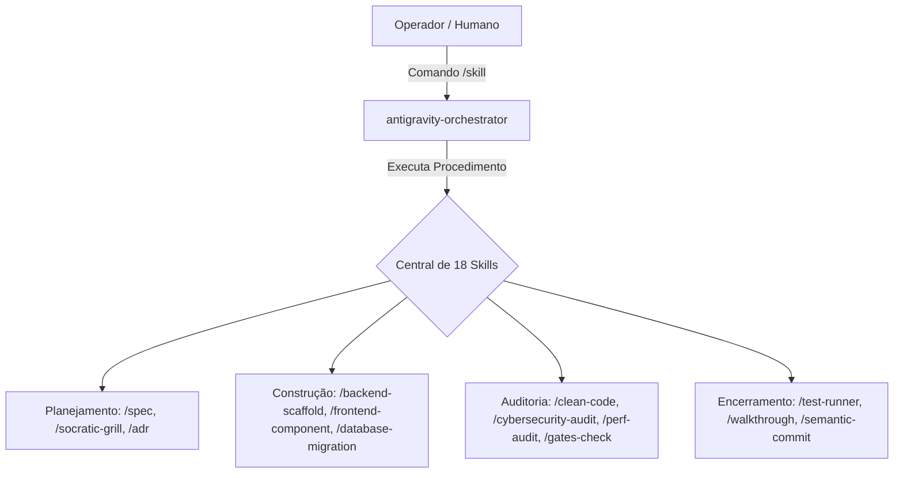

# 04. Catálogo Exaustivo das 18 Skills Universais

> **Guia Oficial de Comandos & Procedimentos Operacionais Padrão (SOP)**  
> **Sistema:** Antigravity Foundry Engine  
> **Total de Skills Documentadas:** 18 Procedimentos Universais  

---

## 1. Visão Geral do Sistema de Skills

As **Skills Universais** do Antigravity Foundry são procedimentos padronizados que podem ser acionados pelo operador humano via comandos de atalho (`/skill`) ou disparados autonomamente pelo Orquestrador Central durante o ciclo de vida do software.



---

## 2. Catálogo Detalhado das 18 Skills Universais

### 1. `/metodo-fundido`
- **Nome Oficial:** Execução Completa do Antigravity Gated SDLC
- **Gatilho Contextual:** Início de qualquer nova funcionalidade, refatoração de grande porte ou correção crítica.
- **Agente Responsável:** `antigravity-orchestrator`
- **Descrição:** Executa os 5 passos do Método Fundido de forma orquestrada (Grill-Me -> Spec -> Workers -> Re-Audit 6 Verifiers -> Prova Real & Commit).
- **Exemplo de Uso:**
  ```text
  /metodo-fundido "Implementar módulo de conciliação bancária idempotente com lock pessimista"
  ```

---

### 2. `/spec`
- **Nome Oficial:** Elaboração de Especificação Técnica & Implementation Plan
- **Gatilho Contextual:** Quando uma demanda necessita de planejamento formal com contratos de dados e escopo.
- **Agente Responsável:** `antigravity-orchestrator` + `chief-erp-architect`
- **Descrição:** Cria o arquivo `implementation_plan.md` a partir do template padrão, contendo regras de negócio, diagramas de sequência Mermaid e checklist dos 6 Verifiers.
- **Exemplo de Uso:**
  ```text
  /spec "Refatorar camada de persistência para suporte a múltiplos tenants"
  ```

---

### 3. `/socratic-grill`
- **Nome Oficial:** Entrevista Socrática & Mapeamento de Edge Cases
- **Gatilho Contextual:** Antes de escrever qualquer plano técnico, para desafiar suposições e antecipar falhas.
- **Agente Responsável:** `chief-erp-architect`
- **Descrição:** Realiza rodada de 5 perguntas incisivas focando em concorrência, falha parcial de rede, payloads malformados, segurança e rollback.
- **Exemplo de Uso:**
  ```text
  /socratic-grill "Novo endpoint de webhook para processamento de pagamentos Pix"
  ```

---

### 4. `/adr`
- **Nome Oficial:** Registro de Decisão Arquitetural (Architecture Decision Record)
- **Gatilho Contextual:** Sempre que uma escolha estrutural de longo prazo for adotada (novo framework, mudança de padrão de banco, mensageria).
- **Agente Responsável:** `chief-erp-architect`
- **Descrição:** Cria um documento `docs/adr/ADR-XXXX.md` contendo contexto, opções avaliadas, prós, contras, trade-offs e mitigações.
- **Exemplo de Uso:**
  ```text
  /adr "Adoção do padrão Outbox Transacional para sincronização de eventos com o Cockpit"
  ```

---

### 5. `/clean-code`
- **Nome Oficial:** Auditoria de Rigor de Código Limpo & SOLID
- **Gatilho Contextual:** Após a escrita de código por qualquer worker construtor.
- **Agente Responsável:** `code-reviewer`
- **Descrição:** Inspeciona complexidade ciclomática (< 10), extensão de métodos (< 25 linhas), nomes expressivos e conformidade com os princípios SOLID e DRY.
- **Exemplo de Uso:**
  ```text
  /clean-code src/services/ConciliacaoService.php
  ```

---

### 6. `/cybersecurity-audit`
- **Nome Oficial:** Auditoria Defensiva OWASP Top 10 & Zero-Trust
- **Gatilho Contextual:** Antes de qualquer liberação de endpoint ou rotina de persistência.
- **Agente Responsável:** `security-auditor`
- **Descrição:** Analisa vulnerabilidades como SQL Injection (checando PDO com prepared statements estritos), sanitização contra XSS, CSRF, validação de tokens e IDOR.
- **Exemplo de Uso:**
  ```text
  /cybersecurity-audit "Revisão geral dos endpoints da pasta /api/v1/pedidos"
  ```

---

### 7. `/test-runner`
- **Nome Oficial:** Execução Automatizada de Testes & Verificação de Borda
- **Gatilho Contextual:** Validação de integridade mecânica antes do parecer dos Verifiers.
- **Agente Responsável:** `test-engineer`
- **Descrição:** Executa as suítes de testes (`npm test`, `pytest`, `phpunit`), avalia relatórios de cobertura (mínimo 80%) e valida testes de regressão.
- **Exemplo de Uso:**
  ```text
  /test-runner --coverage --ci
  ```

---

### 8. `/perf-audit`
- **Nome Oficial:** Auditoria de Latência, Queries N+1 & Eficiência de Memória
- **Gatilho Contextual:** Criação de queries relacionais com JOINs ou endpoints de alta vazão.
- **Agente Responsável:** `performance-verifier`
- **Descrição:** Inspeciona `EXPLAIN` de consultas SQL, detecta queries em loop (N+1) e verifica se a latência p95 permanece abaixo de 200ms sob estresse.
- **Exemplo de Uso:**
  ```text
  /perf-audit "Analisar endpoint GET /api/v1/relatorios/vendas"
  ```

---

### 9. `/gates-check`
- **Nome Oficial:** Validação Determinística dos 6 Portões de Aceite (`GATES.md`)
- **Gatilho Contextual:** Validação formal obrigatória antes de homologação de release.
- **Agente Responsável:** `foundry-builder` + `antigravity-orchestrator`
- **Descrição:** Roda sequencialmente os 6 comandos de terminal definidos no framework Unlazy e aborta imediatamente caso qualquer comando retorne exit code diferente de `0`.
- **Exemplo de Uso:**
  ```text
  /gates-check
  ```

---

### 10. `/walkthrough`
- **Nome Oficial:** Compilação do Relatório de Homologação & Prova Real
- **Gatilho Contextual:** Conclusão de uma entrega validada pelos Verifiers.
- **Agente Responsável:** `tech-writer-verifier`
- **Descrição:** Gera o arquivo `walkthrough.md` com evidências empíricas capturadas diretamente do terminal, carrosséis visuais e checklist de fechamento.
- **Exemplo de Uso:**
  ```text
  /walkthrough "Finalização do Módulo de Cockpit 2D e Templates"
  ```

---

### 11. `/cockpit-telemetry`
- **Nome Oficial:** Sincronização & Inspeção do Antigravity Cockpit 2D
- **Gatilho Contextual:** Para monitorar o estado dos agentes em tempo real, Chain-of-Thought e contadores de passos.
- **Agente Responsável:** `foundry-builder`
- **Descrição:** Inspeciona a integridade da stream SSE em `http://localhost:4444/api/stream`, valida a leitura de sessões no Brain e envia pings de teste.
- **Exemplo de Uso:**
  ```text
  /cockpit-telemetry --status
  ```

---

### 12. `/backend-scaffold`
- **Nome Oficial:** Scaffold de Estruturas Backend Seguras e Tipadas
- **Gatilho Contextual:** Necessidade de criar um novo domínio com rotas, services e repositories.
- **Agente Responsável:** `backend-engineer`
- **Descrição:** Gera controllers RESTful, DTOs de validação e repositórios com PDO parametrizado respeitando o padrão arquitetural do projeto.
- **Exemplo de Uso:**
  ```text
  /backend-scaffold "Entidade Produto: id, sku, nome, preco, estoque"
  ```

---

### 13. `/frontend-component`
- **Nome Oficial:** Construção de Componentes Reativos de Interface
- **Gatilho Contextual:** Criação de telas, modais, formulários ou widgets de dados.
- **Agente Responsável:** `software-engineer`
- **Descrição:** Implementa interface responsiva, com estilos encapsulados, acessibilidade e consumo de dados desacoplado via fetch/SSE.
- **Exemplo de Uso:**
  ```text
  /frontend-component "Widget de monitoramento de cotas de API com barra de progresso e alertas"
  ```

---

### 14. `/database-migration`
- **Nome Oficial:** Criação de Migração DDL Idempotente com Rollback
- **Gatilho Contextual:** Qualquer alteração no esquema relacional (novas tabelas, colunas, índices).
- **Agente Responsável:** `backend-engineer`
- **Descrição:** Escreve scripts SQL com sintaxe `IF NOT EXISTS` / `IF EXISTS`, índices calculados e script correspondente de reversão.
- **Exemplo de Uso:**
  ```text
  /database-migration "Adicionar campo uuid e status_processamento na tabela de faturas"
  ```

---

### 15. `/code-review`
- **Nome Oficial:** Rodada de Revisão por Pares (Peer Review)
- **Gatilho Contextual:** Análise de diff de arquivos antes de mesclagem na branch principal.
- **Agente Responsável:** `code-reviewer` + `chief-erp-architect`
- **Descrição:** Gera relatório em tabela detalhando pontos de melhoria, apontamentos de Clean Code e veredito final (`APPROVED` ou `CHANGES_REQUESTED`).
- **Exemplo de Uso:**
  ```text
  /code-review --diff origin/main..HEAD
  ```

---

### 16. `/secret-scan`
- **Nome Oficial:** Varredura Ativa contra Vazamento de Segredos e Chaves
- **Gatilho Contextual:** Antes de qualquer `git push` ou criação de pacote distribuível.
- **Agente Responsável:** `security-auditor`
- **Descrição:** Executa varredura por regex em busca de padrões de chaves AWS, tokens JWT, senhas de banco de dados e credenciais em arquivos de texto.
- **Exemplo de Uso:**
  ```text
  /secret-scan --staged
  ```

---

### 17. `/api-contract`
- **Nome Oficial:** Geração e Validação de Contrato de Handoff de API
- **Gatilho Contextual:** Quando backend e frontend precisam alinhar contratos antes da codificação paralela.
- **Agente Responsável:** `antigravity-orchestrator`
- **Descrição:** Gera schemas formais em JSON/TypeScript para payloads de requisição, resposta, cabeçalhos e códigos de status HTTP.
- **Exemplo de Uso:**
  ```text
  /api-contract "Endpoint POST /api/v1/pedidos/checkout"
  ```

---

### 18. `/semantic-commit`
- **Nome Oficial:** Geração de Mensagem de Commit Semântico Padronizada
- **Gatilho Contextual:** Momento final de fechamento da entrega após 100% PASS dos portões.
- **Agente Responsável:** `foundry-builder`
- **Descrição:** Analisa o `git diff` e compila uma mensagem de commit seguindo a convenção Conventional Commits (`feat:`, `fix:`, `docs:`, `refactor:`, `test:`).
- **Exemplo de Uso:**
  ```text
  /semantic-commit
  ```
