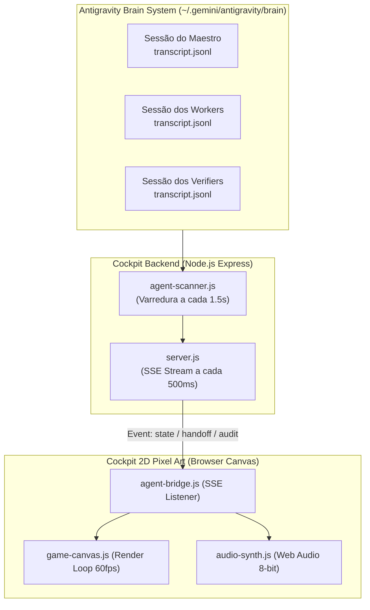

# 05. Manual Operacional do Antigravity Cockpit 2D Pixel Art

> **Guia do Operador & Manual de Telemetria Visual**  
> **Interface:** Antigravity Office 2D Command Center  
> **Porta Padrão:** `http://localhost:4444` (Fallback automático: `4445`)  
> **Tecnologia:** HTML5 Canvas, Web Audio API nativa, SSE (Server-Sent Events)  

---

## 1. Visão Geral da Interface

O **Antigravity Cockpit 2D** é uma estação de comando visual gamificada em estilo Pixel Art retro, projetada para fornecer observabilidade em tempo real sobre a atividade dos agentes autônomos do Antigravity Foundry. Cada agente é renderizado com um avatar pixelizado exclusivo em sua mesa de trabalho, movendo-se, digitando, pensando e interagindo conforme suas sessões reais de execução progridem no sistema.



---

## 2. As 5 Salas Temáticas do Pentágono Sagrado

A planta baixa do escritório 2D é dividida em 5 salas que espelham diretamente os 5 pilares do Pentágono Sagrado de Governança:

```
+-------------------------------------------------------------------------+
|                  SALA 1: ORCHESTRATION & COMMAND CENTER                 |
|             (Mesa Central do Maestro - antigravity-orchestrator)         |
+------------------------------------+------------------------------------+
|    SALA 2: GOVERNANCE ROOM         |    SALA 3: SECURITY BUNKER         |
|  - chief-erp-architect             |  - security-auditor                |
|  - code-reviewer                   |  - performance-verifier            |
+------------------------------------+------------------------------------+
|    SALA 4: DEVELOPMENT LAB         |    SALA 5: QA & DOCUMENTATION      |
|  - software-engineer               |  - test-engineer                   |
|  - backend-engineer                |  - tech-writer-verifier            |
|  - foundry-builder                 |                                    |
+------------------------------------+------------------------------------+
```

1. **Sala 1: Orchestration & Command Center (Púlpito do Maestro):**  
   Localizada na parte superior central. Abriga o `antigravity-orchestrator`. Possui o terminal holográfico de despacho de missões e a visualização do backlog de tarefas em andamento.
2. **Sala 2: Governance Room (Governança & Arquitetura):**  
   Abriga o `chief-erp-architect` e o `code-reviewer`. Decorada com gráficos de arquitetura e estantes de ADRs. É onde ocorrem os reviews conceituais e de Clean Code.
3. **Sala 3: Security Bunker (Ciberdefesa & Performance):**  
   Ambiente de alta segurança com piso reforçado. Abriga o `security-auditor` e o `performance-verifier`. Telas exibem alertas de vulnerabilidade, métricas de latência e contadores OWASP.
4. **Sala 4: Development Lab (Engenharia de Construção):**  
   O laboratório dos operários de código: `software-engineer`, `backend-engineer` e `foundry-builder`. Mesas com monitores múltiplos, animações de digitação rápida e compilação.
5. **Sala 5: QA & Documentation Lab (Homologação & Walkthrough):**  
   Abriga o `test-engineer` e o `tech-writer-verifier`. Equipado com painéis de cobertura de testes automatizados e a bancada de redação de manuais e walkthroughs.

---

## 3. Sintetizador de Áudio 8-bit Nativo (Web Audio API)

O Cockpit possui um motor de áudio procedural sem arquivos `.mp3` ou dependências externas, sintetizando ondas sonoras diretamente através da **Web Audio API**:

- **Bip de Passo (Step Beep):** Tom curto de onda quadrada (Square wave, 880Hz -> 440Hz, 30ms) disparado quando um agente executa um novo step.
- **Teleporte de Handoff (Handoff Woosh):** Efeito de frequência ascendente rápida com modulação senoidal emitido quando uma tarefa voa entre o Maestro e um Worker.
- **Auditoria Aprovada (PASS Fanfare):** Acorde maior brilhante de 3 notas em 8-bit (C5, E5, G5) com envelope de sino retro quando um Verifier homologa a entrega.
- **Auditoria Reprovada (REVISE Alarm):** Onda dente de serra (Sawtooth wave) descendente de alerta quando uma regra de segurança ou lint é violada.
- **Digitação de Pensamento (Typing Clack):** Micro-estalos percussivos gerados por ruído filtrado (White noise burst, 15ms) simulando teclado mecânico retrô enquanto o agente gera Chain-of-Thought.

---

## 4. Extração de Telemetria Profunda (Chain-of-Thought & Steps)

O módulo `agent-scanner.js` realiza uma varredura a cada 1.500ms no diretório do Brain:
1. **Identificação de Sessão Ativa:**  
   Localiza a pasta mais recente de cada agente em `~/.gemini/antigravity/brain/<session-id>/`.
2. **Parsing Incremental do `transcript.jsonl`:**  
   Analisa as mensagens e extrai blocos de raciocínio interno (`<thought>...</thought>`).
3. **Exibição no Modal de Detalhes:**  
   Ao clicar sobre qualquer agente no canvas, um modal translúcido em estilo cyberpunk exibe:
   - **Status Dinâmico:** `IDLE`, `THINKING`, `RUNNING_TOOL` ou `AUDITING`.
   - **Última Ferramenta Invocada:** Ex: `run_command("npm test")`.
   - **Transcrição do Chain-of-Thought:** O fluxo de raciocínio do modelo exibido linha por linha.
   - **Histórico Recente de Interações:** As últimas instruções recebidas.

---

## 5. Contadores Globais e Métricas de Eficiência

No topo da interface do Cockpit, uma barra de status exibe:
- **Total Global de Steps:** Somatório cumulativo de todos os passos de raciocínio de todos os agentes na sessão atual.
- **Ferramentas Invocadas (Tool Calls):** Quantidade total de comandos de sistema, leituras e gravações de arquivos realizadas.
- **Estimativa de Tokens:** Consumo estimado de tokens calculados a partir dos tamanhos dos logs de transcrição.
- **Índice de Homologação (Pass Rate):** Proporção de auditorias aprovadas (`PASS`) em relação a pedidos de revisão (`REVISE`).

---

## 6. Atalhos de Teclado Operacionais

O Cockpit permite controle total do ambiente através do teclado:

| Tecla de Atalho | Ação Executada | Descrição Detalhada |
| :---: | :--- | :--- |
| **`F`** | **Tela Cheia (Full Screen)** | Alterna o navegador para modo imersivo sem barras de interface. |
| **`M`** | **Mudo / Áudio (Mute Toggle)** | Liga ou silencia imediatamente o sintetizador de efeitos 8-bit. |
| **`Space`** | **Pausar / Retomar Stream** | Congela temporariamente a renderização do canvas e os eventos SSE. |
| **`Esc`** | **Fechar Modais / Voltar** | Fecha janelas abertas de transcript, logs ou caixas de diálogo. |
| **`1`** | **Câmera: Orquestração** | Move instantaneamente a câmera para a mesa do Maestro (Sala 1). |
| **`2`** | **Câmera: Governança** | Move o foco para a sala do Architect e Code Reviewer (Sala 2). |
| **`3`** | **Câmera: Bunker** | Foca no Bunker de Cibersegurança e Performance (Sala 3). |
| **`4`** | **Câmera: Desenvolvimento** | Centraliza a visão na bancada de desenvolvimento de software (Sala 4). |
| **`5`** | **Câmera: QA & Documentação**| Enquadra o laboratório de testes e manuais técnicos (Sala 5). |

---

## 7. Suporte Touch & Gestos Mobile

O Cockpit é 100% responsivo para operação em smartphones, tablets e telas sensíveis ao toque:
- **Arrastar com 1 Dedo (Pan):** Desloca suavemente a planta baixa pelo canvas com inércia física.
- **Gesto de Pinça com 2 Dedos (Pinch-to-Zoom):** Aproxima (zoom-in até 2.5x) para inspecionar avatares em detalhe ou afasta (zoom-out até 0.6x) para visão panorâmica de todo o escritório.
- **Toque Único (Tap):** Seleciona o agente e abre a ficha técnica com Chain-of-Thought.
- **Botões Flutuantes Virtuais:** Botões dedicados no canto inferior direito para acesso rápido às funções de som, tela cheia e centralização de câmera sem depender de teclado físico.

---

## 8. Como Iniciar o Cockpit

### No Windows:
```cmd
# Executar a partir do diretório raiz ou da pasta cockpit/
C:\projetos\antigravity-foundry\cockpit\start-cockpit.bat
```

### No Linux / macOS:
```bash
# Dar permissão de execução (se necessário) e rodar
chmod +x /c/projetos/antigravity-foundry/cockpit/start-cockpit.sh
./cockpit/start-cockpit.sh
```

O script verifica automaticamente o Node.js, roda `npm install` se a pasta `node_modules` estiver ausente, inicia o servidor Express na porta 4444 e abre o Cockpit no navegador padrão.
