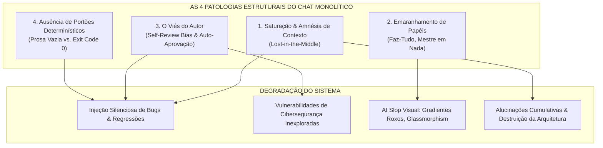
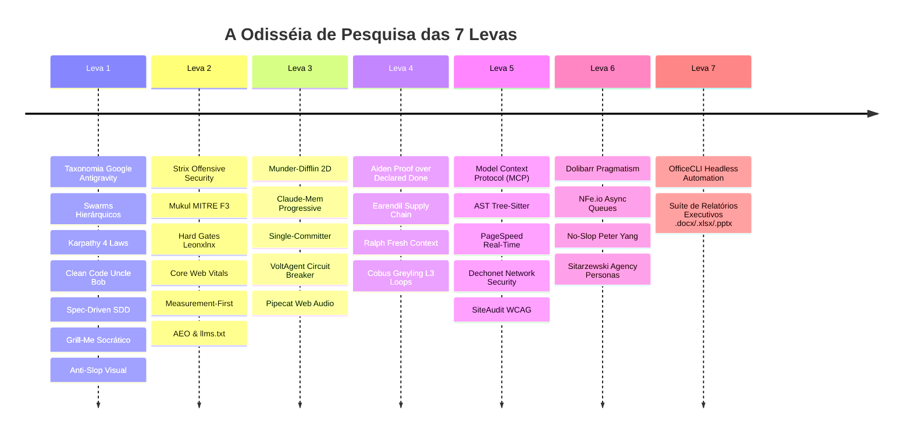
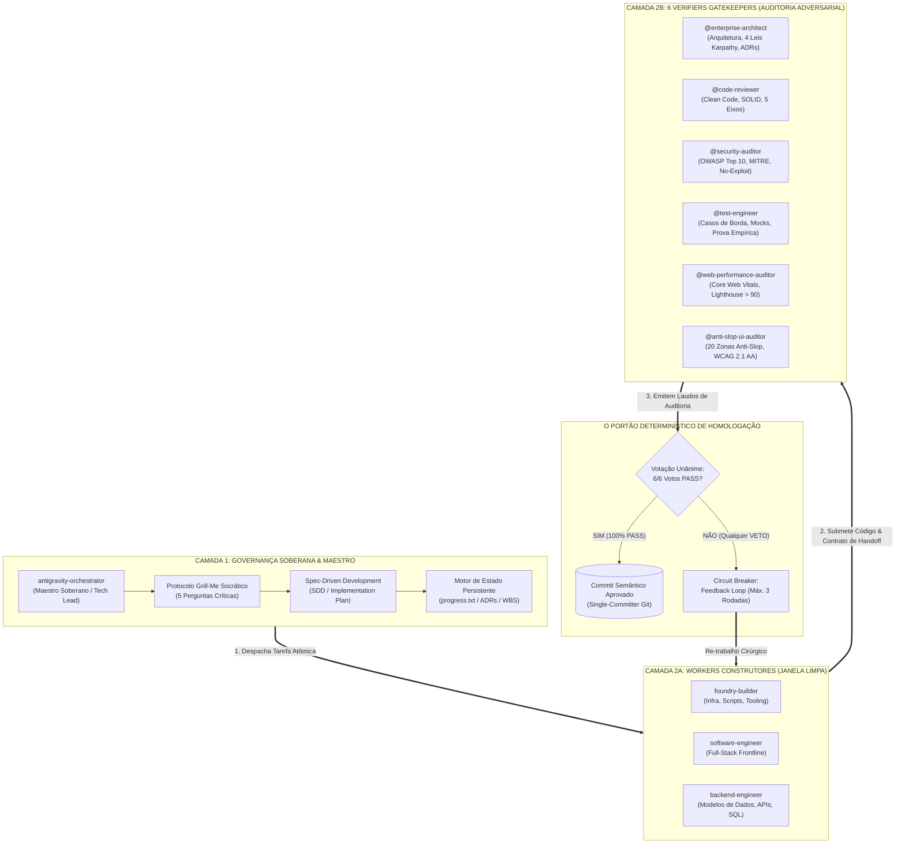
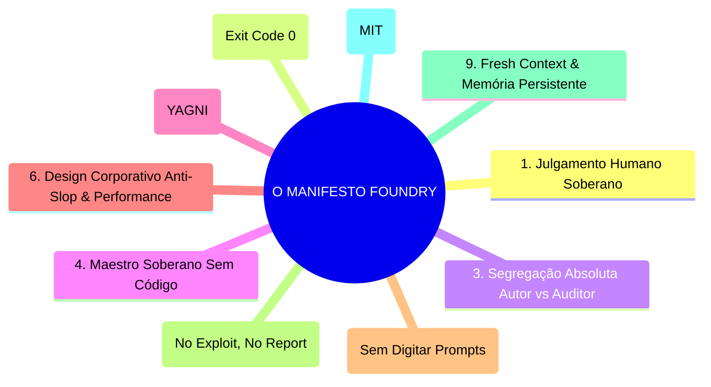

# 🚀 A Trajetória do Antigravity Foundry: Do Colapso dos Chats Monolíticos à Fábrica de Software Autônoma
# 07_THE_FOUNDRY_JOURNEY_AND_MANIFESTO.md

> *"Não construímos ferramentas para substituir o julgamento humano, mas para resgatá-lo da lama do caos não determinístico."*  
> — **Manifesto Antigravity Foundry**

---

## 📑 Sumário Executivo

1. [A Gênese: A Falácia do Chat Monolítico & O Colapso do "Vibecoding"](#1-a-gênese-a-falácia-do-chat-monolítico--o-colapso-do-vibecoding)
2. [A Odisséia de Pesquisa: A Análise das 60 Referências Mundiais](#2-a-odisséia-de-pesquisa-a-análise-das-60-referências-mundiais)
3. [A Grande Síntese: A Arquitetura Soberana do Antigravity Foundry](#3-a-grande-síntese-a-arquitetura-soberana-do-antigravity-foundry)
4. [O Cockpit 2D & O Retorno do Prazer Visual na Engenharia](#4-o-cockpit-2d--o-retorno-do-prazer-visual-na-engenharia)
5. [O Manifesto do Antigravity Foundry (Os 10 Mandamentos da Engenharia Agêntica)](#5-o-manifesto-do-antigravity-foundry)
6. [Do Piloto Restrito ao Ecossistema Universal Open-Source](#6-do-piloto-restrito-ao-ecossistema-universal-open-source)

---

## 1. A Gênese: A Falácia do Chat Monolítico & O Colapso do "Vibecoding"

Entre 2023 e 2025, o mundo da tecnologia testemunhou uma revolução sem precedentes com o surgimento dos Large Language Models (LLMs) generativos aplicados à programação. Inicialmente, o fluxo de trabalho propagado por plataformas e criadores de conteúdo parecia mágico: abria-se uma única janela de chat, digitava-se uma ideia geral de software e o modelo gerava dezenas de arquivos em segundos. Cunhou-se o termo informal *"vibecoding"* — programar ao sabor da intuição, sem atrito aparente.

Porém, para equipes de engenharia que mantêm sistemas corporativos críticos, ERPs, fintechs e bases de código com mais de 50.000 linhas de código, a ilusão durou pouco. Em projetos de escala real, o chat monolítico de IA colapsa invariavelmente sob quatro patologias estruturais severas:



### Patologia 1: Saturação de Janela e Amnésia Arquitetural (*Lost-in-the-Middle*)
Quando uma sessão de chat se estende por mais de 15 interações, a janela de contexto acumula dezenas de milhares de tokens irrelevantes: logs de compilação antigos, trechos de código descartados e tentativas intermediárias. A atenção dos mecanismos de *Self-Attention* se dilui. Diretrizes essenciais definidas no início da sessão (como regras de isolamento multi-tenant, validação estrita de tipos ou limites de paginação) são silenciosamente esquecidas pelo modelo, que começa a inventar convenções incompatíveis.

### Patologia 2: O Emaranhamento Cognitivo (*"O Clínico Geral Imprudente"*)
No modelo de chat único, o mesmo agente é instruído a ser simultaneamente o Arquiteto de Software, o Administrador de Banco de Dados, o Designer de Interfaces, o Especialista em Cibersegurança e o Engenheiro de Testes. Essa sobrecarga de papéis gera respostas superficiais. Um modelo focado em resolver um erro de CSS esquece os índices do banco de dados; um modelo focado em criar um endpoint esquece a higienização contra injeção SQL.

### Patologia 3: O Viés do Autor (*Self-Review Bias*)
Na psicologia cognitiva e na engenharia de software humana, é axioma que **nenhum programador deve ser o único auditor de seu próprio código**. No entanto, nos chats de IA convencionais, o desenvolvedor pergunta à mesma IA que escreveu o código: *"Você revisou o código? Está tudo certo?"*. O modelo inevitavelmente responde: *"Sim, analisei cuidadosamente e o código está perfeito, seguro e pronto para produção!"*. Esse viés de auto-aprovação faz com que falhas grotescas de lógica passem batidas com uma falsa sensação de segurança.

### Patologia 4: A Falácia da Prosa Otimista vs. Prova no Disco (*"Vibecoding"* Desgovernado)
A maior fragilidade dos assistentes convencionais é a substituição de testes por retórica. Se um comando falha ou uma dependência quebra, o modelo diz em prosa convincente: *"Corrigi o problema e a aplicação agora funciona perfeitamente!"*. Quando o desenvolvedor roda o projeto, depara-se com um `SyntaxError` ou `ModuleNotFoundError`. Sem portões executáveis determinísticos, a palavra da IA não tem valor de prova.

---

## 2. A Odisséia de Pesquisa: A Análise das 60 Referências Mundiais

Diante desse diagnóstico brutal, tomamos uma decisão categórica: não criaríamos mais um "wrapper" descartável sobre APIs de chat. Em vez disso, empreendemos uma exaustiva jornada de engenharia reversa e pesquisa comparativa internacional.

Ao longo de sete levas sucessivas, catalogamos, dissecamos e testamos **60 projetos, frameworks, repositórios e referências de engenharia de software e IA** (documentados exaustivamente em [`docs/00_FOUNDATIONAL_REFERENCES.md`](00_FOUNDATIONAL_REFERENCES.md)).



Cada autoridade e repositório forneceu uma peça vital do quebra-cabeça:

1. **Andrej Karpathy (`andrej-karpathy-skills`):** Ensinou-nos as **4 Leis Comportamentais de Engenharia**. A disciplina de pensar profundamente antes de digitar uma linha de código (*Think Before Coding*), repudiar complexidade desnecessária (*Simplicity First / YAGNI*), realizar apenas intervenções cirúrgicas no código existente (*Surgical Changes*) e guiar cada ação por métricas empíricas (*Goal-Driven Execution*).
2. **Matt Pocock (`skills`):** Trouxe o método socrático do **Grill-Me Protocol**. Nenhum agente tem o direito de implementar uma tarefa a partir de comandos vagos. Ele deve questionar ativamente o usuário sobre regras de negócio, casos de borda e restrições de permissão.
3. **Addy Osmani (`agent-skills`, `critical`, `web-quality-skills`):** Introduziu a engenharia de precisão com **Spec-Driven Development (SDD)** e a metodologia **Measurement-First**, auditando Core Web Vitals e Lighthouse em modo headless.
4. **Robert C. Martin (Uncle Bob):** Os princípios imutáveis de **Clean Code** e **SOLID**: funções pequenas, legibilidade narrativa, sem efeitos colaterais ocultos e separação estrita de camadas.
5. **Leonxlnx & Peter Yang (`taste-skill`, `unlazy`, `no-ai-slop`):** Lançaram as bases para a erradicação do "AI Slop" — tanto o visual (os famigerados gradientes roxos, bordas neon e vidros transparentes ilegíveis) quanto o textual (jargões prolixos, falso-profundidade e commits desumanos).
6. **Chaitanya Giri (`munder-difflin`):** Demonstrou a genialidade do padrão **Single-Committer Git** associado a um escritório 2D retro em Pixel Art, permitindo que a orquestração invisível de IAs se transformasse em uma experiência visual tangível e divertida.
7. **Strix AI & Mukul Mahipal (`strix`, `Anthropic-Cybersecurity-Skills`):** Fundaram o princípio inegociável de segurança: *"No exploit, no report"*. Não aceitamos que agentes suponham vulnerabilidades teóricas; exigimos testes de penetração com PoCs reproduzíveis contra a matriz MITRE ATT&CK.
8. **Alex Newman (`claude-mem`) & Ryan Carson (`ralph`):** Apresentaram o conceito de **Progressive Disclosure** e **Fresh Context Loop**: em vez de arrastar históricos gigantescos de mensagens, o estado é mantido em disco e cada agente é invocado com uma janela de contexto limpa e cirúrgica.
9. **Dolibarr Foundation & NFe.io:** Relembraram a importância da solidez corporativa: código direto, transacional, sem camadas excessivas de indireção desnecessária, com suporte a fluxos fiscais e regras contábeis reais.
10. **A Comunidade MCP (Anthropic / Punkpeye / DeusData / GK):** Abriu as portas para ferramentas determinísticas de alta performance baseadas em Model Context Protocol: indexação de AST via Tree-Sitter (`codebase-memory`), diagramas Mermaid automáticos (`repo-cartographer`) e inspeção de cabeçalhos de rede (`dechonet`).

---

## 3. A Grande Síntese: A Arquitetura Soberana do Antigravity Foundry

O Antigravity Foundry é o ponto de convergência de todas essas disciplinas. Não se trata de uma colagem desconexa, mas de uma máquina arquiteturalmente integrada e dividida em duas camadas soberanas.



### A Cláusula Pétrea da Orquestração Soberana
O governador central (`antigravity-orchestrator`) **está expressamente proibido de editar ou criar arquivos de aplicação diretamente**. O Maestro não programa. Sua função primordial é orquestrar, planejar a Work Breakdown Structure (WBS), delegar tarefas atômicas aos workers especializados e confrontar os laudos dos auditores. Isso preserva sua capacidade de raciocínio estratégico e impede o viés do autor.

### A Divisão dos Construtores (Workers)
1. **`backend-engineer`:** Especialista em persistência de dados, isolamento ACID, transações de banco de dados, regras fiscais e endpoints REST/GraphQL. Sempre formula o contrato de dados antes do frontend iniciar.
2. **`software-engineer`:** Especialista em integração full-stack e interface web de alta fidelidade, consumindo o contrato do backend e construindo páginas rápidas e acessíveis.
3. **`foundry-builder`:** O engenheiro de infraestrutura e ecossistema do Foundry, garantindo scripts pré-commit, automações de build e scaffolding de projetos.

### O Tribunal dos 6 Verifiers Gatekeepers
Para que qualquer código alcance o repositório principal, ele precisa ser submetido ao escrutínio independente de seis auditores especialistas adversariais. A aprovação exige **unanimidade absoluta (6/6 votos PASS)**:
- **`enterprise-architect`:** Garante conformidade com as 4 Leis de Karpathy, regras de Clean Architecture e documentação de decisões via ADR.
- **`code-reviewer`:** Avalia os 5 Eixos de Qualidade de Código (Complexidade Ciclomática, Nomenclatura, Efeitos Colaterais, Modularidade e Princípios SOLID).
- **`security-auditor`:** Realiza varreduras estáticas e dinâmicas contra OWASP Top 10 e MITRE ATT&CK, exigindo PoCs sob o princípio "No exploit, no report".
- **`test-engineer`:** Executa a suíte de testes no terminal com asserções de casos de borda e regressão, exigindo cobertura sólida e exit code `0`.
- **`web-performance-auditor`:** Mede o tempo de carregamento, consumo de memória, tamanho de bundle e metas de Core Web Vitals (LCP < 1.2s, INP < 50ms, CLS = 0).
- **`anti-slop-ui-auditor`:** Varre o código em busca dos 20 vícios visuais de AI Slop, exige conformidade WCAG 2.1 AA (contraste > 4.5:1) e numerais tabulares em tabelas financeiras.

---

## 4. O Cockpit 2D & O Retorno do Prazer Visual na Engenharia

A automação por IA não precisa ser uma experiência cinzenta, invisível ou confinada a linhas intermináveis de terminal. Inspirado pela genialidade de Chaitanya Giri em `munder-difflin`, o Foundry integra nativamente o **Antigravity Cockpit 2D** (`cockpit/`).

```
+-----------------------------------------------------------------------------------+
| 🏢 ANTIGRAVITY FOUNDRY COCKPIT - 60 FPS RETRO PIXEL-ART COMMAND CENTER           |
+-----------------------------------------------------------------------------------+
|  [SALA DE GOVERNANÇA]      [SALA DE DEV]         [LABORATÓRIO QA]  [BUNKER SEC]   |
|   👑 Maestro (Planejando)   🔨 Backend (SQL)      🧪 Tester (Jest)  🛡️ Security    |
|   📋 SDD Plan: WBS #04      💻 Frontend (CSS)     ⚡ Perf (LCP)     🔍 Scanner    |
+-----------------------------------------------------------------------------------+
|  HUD TELEMETRIA VIVA: Agents: 9 Active | Steps: 42 | Gates: [5/6 PASS] | Lat: 12ms|
|  AUDIO SYNTH: [●] 8-Bit Chiptune Web Audio Synthesizer (Active Soundscape)       |
+-----------------------------------------------------------------------------------+
```

- **Renderização a 60 FPS sem Lag:** Desenvolvido em HTML5 Canvas nativo com técnicas herdadas do `gsap-skills`, atualizando posições de sprites, estados e animações sem causar refluxos de layout (*layout thrashing*).
- **Sintetizador Web Audio Procedural:** Sons em tempo real inspirados no framework `pipecat`, emitindo beeps agradáveis de chiptune procedural a cada transição de estado (`planning`, `building`, `gate_passed`, `gate_vetoed`).
- **Telemetria SSE com Daemon Herdr:** Streaming contínuo e assíncrono de eventos direto do disco para o navegador via Server-Sent Events, sem sobrecarregar a memória dos agentes de IA.

---

## 5. O Manifesto do Antigravity Foundry

Inscritos no coração do projeto, os **10 Mandamentos da Engenharia Agêntica Soberana** norteiam cada decisão arquitetural do ecossistema:



### I. O Julgamento Pertence ao Humano, a Disciplina Pertence ao Sistema
A IA é um multiplicador de força intelectual extraordinário, mas carece de intencionalidade de negócio. O desenvolvedor humano é o Arquiteto-Chefe e a autoridade final; o Foundry fornece a esteira de rigor mecânico que impede que falhas humanas ou de IA cheguem a produção.

### II. Prosa Retórica não é Evidência — Prova é Terminal com Exit Code `0`
Afirmações verbais em linguagem natural como *"O teste passou perfeitamente"* valem zero. A única moeda aceita no Foundry é a captura do comando no terminal com código de saída `0` e saída padrão auditável gravada em artefato.

### III. Quem Escreve Código Jamais Audita o Próprio Código
A separação entre quem constrói e quem audita é inviolável. Workers implementam; Verifiers auditam. Nenhum commit é executado sem a aprovação unânime dos 6 Verifiers Gatekeepers.

### IV. O Maestro Central Nunca Toca no Código da Aplicação
O orquestrador existe para questionar, estruturar, decompor problemas e governar o fluxo. Se o Maestro começar a digitar código, ele perde a visão panorâmica e é sugado pelo emaranhamento cognitivo.

### V. Menos Código é Mais Inteligência (As Leis de Karpathy)
Repudiamos o inchaço de código e o excesso de bibliotecas. Cada linha adicionada é um passivo de manutenção futuro. Adotamos o princípio de YAGNI (*You Aren't Gonna Need It*) e mudanças cirúrgicas precisas.

### VI. O Design Corporativo Repudia o AI Slop, a Latência e a Inacessibilidade
Proibimos gradientes roxo-azulados, botões transparentes espelhados, emojis pueris em títulos H1/H2 e cartões borrados com glassmorphism. Construímos interfaces limpas, sólidas, tipograficamente suíças, com contraste real (WCAG 2.1 AA > 4.5:1), numerais tabulares para visualização séria de dados e Core Web Vitals impecáveis (LCP < 1.2s, INP < 50ms, CLS = 0).

### VII. O Desenvolvedor Não é Digitador de Prompts (Zero-Overhead UX)
A IA deve ser inteligente o suficiente para saber quando ativar cada ferramenta, skill e auditoria sem exigir que o ser humano seja um operador de terminal de comandos. Em outros ecossistemas, o desenvolvedor é sobrecarregado pela obrigação de memorizar dezenas de `/skills` ou invocar `@agentes` manuais. No Foundry, o engenheiro humano dialoga em linguagem natural casual; o Maestro analisa a intenção em segundo plano e mobiliza a esteira de forma 100% autônoma. Menos atrito cognitivo, máxima engenharia de software.

### VIII. Segurança Não é Checklist Teórico — É "No Exploit, No Report"
Não emitimos laudos de vulnerabilidades baseados em achismos. A auditoria de segurança exige comprovação empírica por meio de Proof-of-Concept reproduzível, sanitização estrita de inputs, blindagem contra OWASP Top 10 e remediação validada.

### IX. Memória Persistente e Sessões Limpas
A janela de contexto de um agente de IA deve ser mantida o mais limpa e focada possível (*Progressive Disclosure*). A memória do projeto reside no disco — em planos de implementação, WBS, contratos de portão e registros de decisão (ADRs) — e não em históricos poluídos de chat.

### X. Liberdade Open-Source Universal
A verdadeira excelência de engenharia deve ser aberta, auditável e compartilhada com o mundo. O Antigravity Foundry é distribuído sob licença MIT universal, livre para uso individual, acadêmico e corporativo.

---

## 6. Do Piloto Restrito ao Ecossistema Universal Open-Source

O que começou como um esforço obstinado para resolver os desafios de engenharia do ecossistema de gestão e automação corporativa rapidamente se provou muito maior do que um único projeto.

Ao percebermos que todo desenvolvedor de software no mundo estava enfrentando as mesmas dores — o cansaço dos chats prolixos, a proliferação de bugs de IA em bases corporativas, o declínio na qualidade das interfaces e a frustração do "vibecoding" descontrolado —, decidimos desacoplar toda a infraestrutura e transformá-la no **Antigravity Foundry**: um framework agnóstico de stack, universal e totalmente aberto.

Seja você um desenvolvedor solo construindo um micro-SaaS, um Tech Lead liderando dezenas de engenheiros em uma corporação, ou um pesquisador explorando os limites de arquiteturas multiagente, o Antigravity Foundry oferece as fundações sólidas para que você possa construir com audácia, velocidade e **disciplina inabalável**.

O futuro da engenharia de software não pertence ao chat monolítico.  
**O futuro pertence à Fábrica de Software Autônoma.**

---

*Bem-vindo ao Antigravity Foundry. Onde a precisão encontra a autonomia.*
