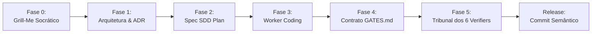

# 🛠️ Tutoriais Práticos: Do Zero à Produção com o Antigravity Foundry
# 08_STEP_BY_STEP_TUTORIALS.md

> *"Diga-me e eu esquecerei. Ensine-me e eu me lembrarei. Envolva-me e eu aprenderei."*  
> — **Benjamin Franklin**

Bem-vindo ao guia prático oficial do **Antigravity Foundry**. Este manual foi projetado para desenvolvedores, arquitetos de software e líderes técnicos que desejam sair do zero e dominar a esteira de engenharia agêntica do Foundry em seus projetos do dia a dia.

---

## 📑 Índice dos Tutoriais

1. [Tutorial 1: Configuração Inicial e Setup em 2 Minutos](#tutorial-1-configuração-inicial-e-setup-em-2-minutos)
2. [Tutorial 2: Executando um Ciclo Completo Gated SDLC (De Ponta a Ponta)](#tutorial-2-executando-um-ciclo-completo-gated-sdlc-de-ponta-a-ponta)
3. [Tutorial 3: Adaptando o Foundry para Qualquer Stack Tecnológica](#tutorial-3-adaptando-o-foundry-para-qualquer-stack-tecnológica)
4. [Tutorial 4: Operando e Customizando o Cockpit 2D em Pixel Art](#tutorial-4-operando-e-customizando-o-cockpit-2d-em-pixel-art)

---

## Tutorial 1: Configuração Inicial e Setup em 2 Minutos

O Antigravity Foundry foi projetado para ser leve, sem dependências proprietárias pesadas e imediatamente funcional.

### 1.1. Pré-Requisitos do Ambiente
- **Git** (versão 2.30 ou superior)
- **Python 3.10+** (necessário para os scripts de proteção e scanner de segredos)
- **Navegador Web Moderno** (Chrome, Edge, Firefox ou Brave com suporte a Canvas HTML5 e Web Audio)
- **Google Antigravity 2.0** (ou ambiente compatível com chamadas MCP e orquestração de subagentes)

### 1.2. Clonando o Repositório
Abra seu terminal preferido (PowerShell no Windows, Bash no Linux/macOS) e execute:

```bash
# Clone o repositório oficial
git clone https://github.com/mrcodingdev/antigravity-foundry.git

# Acesse o diretório do projeto
cd antigravity-foundry
```

### 1.3. Validando o Pre-Commit Secrets Shield
O Foundry inclui um scanner de proteção contra vazamento acidental de chaves de API (`sk-proj`, `sk-ant`, AWS, tokens JWT, senhas hardcoded). Teste a integridade do escudo executando:

```bash
# No Windows (PowerShell)
python .agents/scripts/pre_commit_secrets_shield.py

# No Linux / macOS
python3 .agents/scripts/pre_commit_secrets_shield.py
```

**Saída Esperada:**
```text
[PASS] Pre-Commit Secrets Shield: Nenhum arquivo staged ou diff vazio.
```

Para instalar o escudo como hook nativo do Git e impedir qualquer commit com segredos:

```bash
# No Linux / macOS / Git Bash
ln -s ../../.agents/scripts/pre_commit_secrets_shield.py .git/hooks/pre-commit
chmod +x .git/hooks/pre-commit

# No Windows (PowerShell)
Copy-Item .agents/scripts/pre_commit_secrets_shield.py .git/hooks/pre-commit
```

### 1.4. Verificação Estrutural de Pastas
Certifique-se de que a estrutura canônica está presente:
```
antigravity-foundry/
├── .agents/
│   ├── rules/          # Cláusulas pétreas e diretrizes de arquitetura/design
│   ├── skills/         # 18 Skills universais em formato Markdown
│   ├── subagents/      # Personas dos 3 Workers e 6 Verifiers
│   └── scripts/        # Pre-commit Secrets Shield e utilitários
├── cockpit/            # Command Center 2D Pixel Art (HTML5/Canvas/SSE)
├── docs/               # Documentação técnica e compêndios
└── templates/          # Templates para ADRs, SDD Plans e Gates
```

---

## Tutorial 2: Executando um Ciclo Completo Gated SDLC (De Ponta a Ponta)

Neste tutorial, vamos simular o desenvolvimento de uma funcionalidade real: **"Módulo de Gestão de Ordens de Serviço com Exportação de Relatórios"**. Seguiremos rigorosamente as 5 Fases do Método Fundido de Trabalho.



### Passo 1: Solicitação Casual em Linguagem Natural (Zero-Overhead UX)
O desenvolvedor humano **não precisa memorizar comandos de barra (`/slash`) nem convocar subagentes manualmente (`@agente`)**. Ele simplesmente digita uma mensagem casual em português no chat:

> **Desenvolvedor Humano:**  
> *"Maestro, precisamos adicionar um campo de telefone na tela de cadastro de clientes com validação e máscara, e persistir no banco."*

#### O que o Maestro faz sozinho nos bastidores (Intent Router & Autonomous Dispatcher):
1. O **Intent Router** analisa a semântica da mensagem em background e classifica:  
   `Intenção = Nova Feature (Persistência DDL + API REST + UI Frontend)`.
2. O Maestro **não gera código às cegas** e não exige que o desenvolvedor lembre de digitar `/metodo-fundido` ou `/spec`. Ele ativa proativamente em segundo plano as skills `spec-driven-development` e `planning-and-task-breakdown`, acionando a bateria socrática do **Protocolo Grill-Me Socrates**:

> **Orquestrador Maestro (Resposta Proativa Automática):**  
> *"Perfeito! Mapeei a demanda. Como envolve alteração de schema SQL, endpoint de API e interface de usuário, ativei o protocolo de especificação técnica. Antes de despachar os Workers, preciso clarificar 4 invariantes de negócio:*  
> 1. **Formato & Validação:** O telefone deve seguir formato internacional E.164 (`+55 11 98765-4321`) ou apenas nacional com DDD (10 ou 11 dígitos)?  
> 2. **Integridade de Banco:** O campo pode ser nulo para clientes legados? Devemos aplicar índice `UNIQUE` para evitar cadastros duplicados?  
> 3. **Comportamento UI:** A máscara deve formatar dinamicamente enquanto o usuário digita no padrão Swiss Design (sem pular o cursor)?  
> 4. **Acessibilidade:** Devemos incluir suporte a leitores de tela (`aria-label`, `aria-invalid`) e validação no evento `onBlur`?"*

O desenvolvedor responde casualmente:
> **Desenvolvedor Humano:**  
> *"Padrão nacional com DDD, opcional para legados mas único se informado, máscara dinâmica sem lag e acessibilidade WCAG completa."*

### Passo 2: Geração Autônoma da Formal Spec & Implementation Plan
Sem que o humano precise solicitar `/spec`, o Maestro compila os requisitos, define o plano técnico e instancia as tarefas atômicas:

1. **Criação do ADR:** `docs/adr/0004-service-orders-state-machine.md` definindo a máquina de estados das ordens (`DRAFT` ➔ `PENDING` ➔ `IN_PROGRESS` ➔ `COMPLETED` ➔ `BILLED`).
2. **Criação do SDD Plan:** `templates/implementation_plan_template.md` instanciado com a WBS detalhada:
   - Task 1: Modelo de dados e migração SQL (`backend-engineer`).
   - Task 2: Endpoints REST com validação de payload (`backend-engineer`).
   - Task 3: Contrato de Handoff OpenAPI / TypeScript DTOs.
   - Task 4: Tela de Gestão de Ordens no padrão Swiss Design (`software-engineer`).
   - Task 5: Suíte de testes unitários e de integração (`test-engineer`).

### Passo 3: Fase 3 (Construção com Handoff Sequencial dos Workers)
O Maestro despacha o primeiro worker em janela de contexto limpa:

1. **Despacho do `backend-engineer`:**
   - Cria o modelo `ServiceOrder` com campos auditáveis (`created_at`, `updated_at`, `user_id`, `status`, `total_amount`).
   - Aplica transação atômica ACID na mudança de status.
   - Gera o arquivo de contrato: `contracts/service_order_v1.json`.
2. **Passagem de Bastão (Handoff):**
   - O `backend-engineer` conclui sua entrega e emite o relatório de handoff.
3. **Despacho do `software-engineer`:**
   - Recebe o contrato `contracts/service_order_v1.json`.
   - Constrói a tabela corporativa com `font-variant-numeric: tabular-nums`, sem gradientes roxos, com suporte a teclado e foco visível (WCAG 2.1 AA).

### Passo 4: Fase 4 & 5 (Contrato GATES.md e Auditoria Unânime dos 6 Verifiers)
O Maestro cria o arquivo de verificação determinística `GATES.md`:

```markdown
# GATES.md - Service Orders Module
- [ ] Portão 1 (Arquitetura): 4 Leis Karpathy & Clean Architecture
- [ ] Portão 2 (Clean Code): Linter 0 erros, sem complexidade ciclomática alta
- [ ] Portão 3 (Segurança): Sem injeção SQL, autorização RBAC verificada
- [ ] Portão 4 (Testes): pytest / jest com exit code 0
- [ ] Portão 5 (Performance): Resposta API < 100ms, bundle UI < 150KB
- [ ] Portão 6 (Anti-Slop & UI): Zero gradientes, contraste > 4.5:1, tabular-nums
```

O Maestro convoca os **6 Verifiers Gatekeepers**. Cada auditor executa testes de terminal e emite seu veredito:

| Auditor | Domínio | Veredito | Evidência de Terminal |
| :--- | :--- | :---: | :--- |
| `@enterprise-architect` | Conformidade de Arquitetura | **PASS** | ADR-0004 vinculado, camadas desacopladas |
| `@code-reviewer` | Clean Code & SOLID | **PASS** | Ruff/ESLint: 0 erros, 0 warnings |
| `@security-auditor` | Pentest Ofensivo (OWASP) | **PASS** | PoC de injeção bloqueada pelo ORM |
| `@test-engineer` | Asserção Empírica de Testes | **PASS** | `pytest tests/test_service_orders.py` (14 passed) |
| `@web-performance-auditor` | Latência & Core Web Vitals | **PASS** | LCP = 0.8s, INP = 18ms, CLS = 0 |
| `@anti-slop-ui-auditor` | 20 Zonas Anti-Slop | **PASS** | Score 100/100, sem glassmorphism |

### Passo 5: Fase 6 (Commit Semântico via Single-Committer)
Com **6/6 votos unânimes**, o Maestro despacha o commit semântico:

```bash
git add .
git commit -m "feat(orders): implement service orders module with RBAC and report export

- Add ServiceOrder entity and ACID status transitions
- Implement REST API endpoints with schema validation
- Build enterprise tabular UI compliant with WCAG 2.1 AA
- Add test suite covering edge cases (14 tests passed)
- ADR-0004 documented and 6/6 Gatekeepers approved"
```

---

## Tutorial 3: Adaptando o Foundry para Qualquer Stack Tecnológica

O Antigravity Foundry é agnóstico por design. A seguir, veja como adaptá-lo para duas das stacks modernas mais populares.

### 3.1. Adaptação para Stack Python (FastAPI + SQLAlchemy + React Vite)

#### Passo 1: Customizar Comandos de Verificação em `.agents/rules/01_core_architecture_rules.md`
Adicione os comandos oficiais de validação da sua stack:

```markdown
### Validação Obrigatória da Stack Python/React:
- Backend Lint: `ruff check backend/`
- Backend Typecheck: `mypy backend/`
- Backend Tests: `pytest backend/tests/ -v --cov=backend`
- Frontend Lint: `npm --prefix frontend run lint`
- Frontend Tests: `npm --prefix frontend run test:run`
```

#### Passo 2: Ajustar as Personas dos Workers
Em `.agents/subagents/workers/backend-engineer.md`, declare o uso de Pydantic v2 e SQLAlchemy 2.0 async:
```markdown
Stack Oficial: FastAPI, Pydantic v2, SQLAlchemy 2.0 (Async), PostgreSQL, Alembic.
Regra de Ouro: Todos os schemas de entrada devem usar validação estrita (Pydantic Field).
```

---

### 3.2. Adaptação para Stack TypeScript (NestJS + Prisma + Next.js App Router)

#### Passo 1: Customizar Comandos de Verificação
Em `.agents/rules/01_core_architecture_rules.md`:

```markdown
### Validação Obrigatória da Stack NestJS/Next.js:
- Backend Lint & Typecheck: `npm --prefix api run lint && npm --prefix api run typecheck`
- Backend Tests: `npm --prefix api run test:e2e`
- Frontend Build: `npm --prefix web run build`
- Frontend Tests: `npm --prefix web run test`
```

#### Passo 2: Ajustar a Persona do `@anti-slop-ui-auditor`
Em `.agents/subagents/verifiers/anti-slop-ui-auditor.md`, instrua a validação com Tailwind CSS e shadcn/ui sóbrio:
```markdown
Regra Específica: Não permitir classes 'backdrop-blur-*', 'bg-gradient-to-*' ou botões com 'hover:scale-110'.
Exigir componentes Radix UI com acessibilidade nativa e classes neutras ('zinc' ou 'slate').
```

---

## Tutorial 4: Operando e Customizando o Cockpit 2D em Pixel Art

O **Antigravity Cockpit 2D** (`cockpit/`) oferece uma central visual inspirada em *munder-difflin*, permitindo acompanhar seus agentes em tempo real.

```
+-------------------------------------------------------------------------------+
|  COCKPIT 2D QUICK RUNNER                                                      |
+-------------------------------------------------------------------------------+
|  1. Inicie o servidor local:  npx serve cockpit -p 8080                       |
|  2. Abra no navegador:        http://localhost:8080                           |
|  3. Clique no botão de áudio: [ Ativar Web Audio Synthesizer ]                |
+-------------------------------------------------------------------------------+
```

### 4.1. Executando o Cockpit Localmente
Você pode servir a pasta `cockpit/` com qualquer servidor HTTP estático:

```bash
# Opção A: Usando Python (nativo)
cd cockpit
python -m http.server 8080

# Opção B: Usando Node.js / npx
npx serve cockpit -p 8080
```

Abra seu navegador em `http://localhost:8080`. Você verá o andar corporativo com os 9 agentes posicionados em suas respectivas estações de trabalho:
- **Sala de Governança:** `antigravity-orchestrator`
- **Sala de Desenvolvimento:** `backend-engineer`, `software-engineer`, `foundry-builder`
- **Bunker de Cibersegurança:** `security-auditor`
- **Laboratório de QA & Performance:** `enterprise-architect`, `code-reviewer`, `test-engineer`, `web-performance-auditor`, `anti-slop-ui-auditor`

### 4.2. Ativando o Sintetizador Web Audio
Por políticas dos navegadores, áudios procedurais só podem ser emitidos após uma interação do usuário. Clique no ícone de alto-falante no canto superior direito do Cockpit. O sintetizador chiptune começará a emitir notas sutis em tempo real:
- **Nota C4 (Curta):** Agente iniciou leitura de arquivo.
- **Acorde Maior (G-C-E):** Portão de verificação aprovado (100% PASS).
- **Nota Baixa F#2:** Veto de portão emitido por auditor (necessário retrabalho).

### 4.3. Customizando Agentes e Estações
Para adicionar novos agentes ou renomear salas, edite o arquivo de configuração `cockpit/agent-scanner.js`:

```javascript
// Exemplo: Adicionando um agente especialista em Machine Learning
const CUSTOM_AGENTS = [
  {
    id: "ml-engineer",
    name: "ML Ops Specialist",
    room: "lab-qa",
    color: "#9b59b6",
    initialPosition: { x: 320, y: 180 },
    badge: "PyTorch/ONNX"
  }
];
```

Recarregue a página do Cockpit e o novo sprite aparecerá instantaneamente com animações sincronizadas a 60 FPS.

---

## 🎯 Próximos Passos & Leituras Recomendadas
- Leia a especificação profunda da arquitetura em [**`docs/01_ARCHITECTURE.md`**](01_ARCHITECTURE.md).
- Domine o catálogo completo de skills em [**`docs/04_SKILLS_CATALOG.md`**](04_SKILLS_CATALOG.md).
- Conheça a história e os 10 Mandamentos em [**`docs/07_THE_FOUNDRY_JOURNEY_AND_MANIFESTO.md`**](07_THE_FOUNDRY_JOURNEY_AND_MANIFESTO.md).
