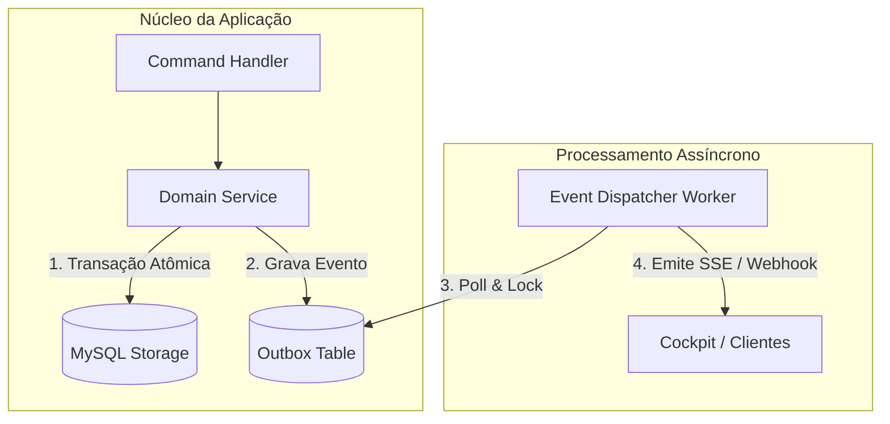

# ADR-[XXXX]: [Título Claro e Conciso da Decisão Arquitetural]

> **Status:** `[PROPOSED | ACCEPTED | REJECTED | DEPRECATED | SUPERSEDED]`  
> *(Se SUPERSEDED, especificar: Substituído por [ADR-YYYY])*  
> **Data:** `YYYY-MM-DD`  
> **Decisores:** `[chief-erp-architect, antigravity-orchestrator, tech-leads]`  
> **Contexto / Módulo Afetado:** `[Ex: core/database, api/auth, cockpit/sse]`  

---

## 1. Contexto & Declaração do Problema (Context & Problem Statement)

*Descreva as forças motrizes que motivaram esta decisão. Qual problema técnico, organizacional ou de desempenho estamos tentando resolver? Quais restrições de arquitetura existem?*

- **Gargalo ou Desafio Observado:**  
  `[Descreva com precisão a limitação da solução atual, como degradação de concorrência, acoplamento excessivo ou falha de observabilidade.]`

- **Forças & Requisitos em Conflito (Drivers):**
  1. **Velocidade de Entrega vs. Rigor Arquitetural:** Necessidade de manter alta cadência sem violar o isolamento de camadas.
  2. **Consumo de Recursos vs. Resposta em Tempo Real:** Manter SSE com polling de baixa latência sem sobrecarregar o I/O de disco.
  3. **Segurança vs. Ergonomia de Uso:** Políticas de zero-trust sem inviabilizar a integração entre workers.

---

## 2. Alternativas Avaliadas (Options Considered)

| Critério de Comparação | Opção 1: [Abordagem A] | Opção 2: [Abordagem B] | Opção 3: [Decisão Escolhida] |
| :--- | :--- | :--- | :--- |
| **Complexidade de Implementação** | Baixa | Alta | Média |
| **Escalabilidade & Performance** | Limitada | Alta | Alta e Determinística |
| **Acoplamento com Terceiros** | Elevado | Médio | Zero (Autocontido) |
| **Alinhamento com 4 Leis Karpathy** | Parcial | Parcial | 100% Conforme |
| **Veredito da Avaliação** | *Rejeitado* | *Rejeitado* | **Aprovado** |

### Justificativa das Opções Rejeitadas:
- **Opção 1:** `[Explicar por que a Opção 1 falha em atender os requisitos de longo prazo ou introduz riscos inaceitáveis.]`
- **Opção 2:** `[Explicar o overhead desproporcional ou complexidade acidental trazida pela Opção 2.]`

---

## 3. Decisão Arquitetural Adotada (Decision Outcome)

*Declaramos explicitamente a decisão tomada e os fundamentos de design que sustentam essa escolha.*

**Decidimos adotar:** `[Descreva claramente a abordagem adotada. Ex: Adoção do padrão Outbox transacional com polling determinístico pelo worker de eventos.]`

### 3.1 Fundamentos Técnicos
1. `[Fundamento 1: Ex: Atomicidade garantida pela transação ACID do MySQL InnoDB.]`
2. `[Fundamento 2: Ex: Idempotência nas mensagens através de UUID v4 gravado no cabeçalho.]`
3. `[Fundamento 3: Ex: Desacoplamento do ciclo de vida do cliente HTTP em relação à mensageria.]`

### 3.2 Diagrama Arquitetural da Decisão

---

## 4. Consequências & Trade-offs (Consequences)

Toda decisão arquitetural envolve concessões explícitas. Mapeamos os impactos positivos, negativos e suas mitigações.

### 4.1 Consequências Positivas (Ganhos)
- **Consistência Forte:** Elimina condições de corrida em operações críticas de escrita.
- **Rastreabilidade Total:** Cada evento possui identificador único e carimbo temporal rastreável no log.
- **Resiliência a Falhas:** Falhas momentâneas na rede não perdem mensagens nem corrompem o estado de domínio.

### 4.2 Consequências Negativas (Custos & Overhead)
- **Latência de Processamento Indireto:** Pequeno atraso (50ms - 200ms) até que o dispatcher processe a outbox.
- **Consumo de Armazenamento:** A tabela de outbox cresce continuamente e requer rotina de expurgo (cleanup).

### 4.3 Mitigações dos Riscos
- **Rotina de Purge:** Implementação de cron job diário para arquivar eventos processados com mais de 30 dias.
- **Índice Estruturado:** Criação de índice composto `(status, created_at)` para garantir que o polling execute em < 5ms.

---

## 5. Conformidade com as 4 Leis Comportamentais de Andrej Karpathy

- [x] **1. Think Before Coding (Pense Antes de Codificar):** A decisão foi discutida e validada através de especificação formal e Socratic Grill-Me.
- [x] **2. Simplicity First (Simplicidade em Primeiro Lugar):** Evitou frameworks externos desnecessários, utilizando primitivas nativas robustas.
- [x] **3. Surgical Precision (Precisão Cirúrgica):** Apenas os módulos afetados foram refatorados, preservando interfaces legadas intactas.
- [x] **4. Goal-Driven Execution (Execução Orientada a Metas):** A solução resolve diretamente a dor mapeada com métricas mensuráveis.

---

## 6. Plano de Validação & Critérios de Rollback

### Validação em Homologação:
1. Executar suíte de testes de estresse com `autocannon` ou script concorrente.
2. Monitorar a latência da tabela de outbox sob carga de 100 requisições simultâneas.
3. Obter parecer `PASS` unânime dos 6 Verifiers Gatekeepers.

### Procedimento de Rollback:
- Caso o dispatcher apresente travamento ou contenção excessiva de locks:
  1. Reverter a feature flag `FEATURE_OUTBOX_DISPATCHER=false`.
  2. Executar script de rollback `migrations/rollback_adr_xxxx.sql`.
  3. Notificar o canal de observabilidade e reabrir a discussão técnica.
