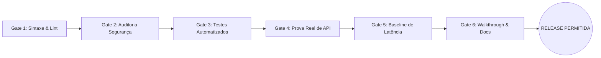

# GATES.md: Contrato Determinístico de Portões de Aceite (Unlazy Framework)

> **Projeto:** `[Nome do Projeto / Módulo]`  
> **Versão do Protocolo:** `v1.0.0 (Leonxlnx/unlazy Inspired Gatekeeper)`  
> **Filosofia Fundamental:** *"Se não foi executado no terminal com exit code 0 e prova real anexada, a tarefa NÃO EXISTE."*  
> **Regra de Ouro:** Nenhum pull request, merge ou release é aceito com portões em status `BYPASS`, `PENDING` ou `FAILED`.

---

## 1. Visão Geral dos 6 Portões Inegociáveis (The 6 Gates Pipeline)



---

## 2. Portões Determinísticos de Execução

### Gate 1: Validação de Sintaxe e Tipagem Estrita (Zero Errors)
- **Propósito:** Garantir que nenhum arquivo contenha erros de sintaxe, imports quebrados ou desvios de lint.
- **Critério Inegociável:** Exit code `0`; `0 errors`, `0 warnings`.

#### Comandos de Execução:
```bash
# Para projetos Node.js / TypeScript:
npm run lint && npx tsc --noEmit

# Para projetos PHP:
find src/ -type f -name "*.php" -exec php -l {} \; | grep -v "No syntax errors detected" && exit 1 || echo "Gate 1 PHP Syntax: PASS"

# Para projetos Python:
python -m flake8 src/ --max-line-length=120 --exclude=venv
```

- **Ação em Caso de Falha:** Rejeição imediata da tarefa. O desenvolvedor/worker deve corrigir os arquivos apontados antes de prosseguir.

---

### Gate 2: Auditoria de Segurança & OWASP (Zero Vulnerabilities)
- **Propósito:** Impedir que vulnerabilidades de dependências, injeções SQL, falhas de sanitização ou segredos vazados cheguem à produção.
- **Critério Inegociável:** Zero vulnerabilidades de severidade Alta ou Crítica; zero segredos ou chaves no código-fonte.

#### Comandos de Execução:
```bash
# Verificação de dependências vulneráveis:
npm audit --audit-level=high

# Detecção de credenciais ou segredos commitados:
git diff HEAD~1 | grep -iE "(password|secret|apikey|token|private_key)\s*[:=]" && echo "ALERTA: Possível vazamento de segredo!" && exit 1 || echo "Gate 2 Secrets: PASS"

# Verificação de SQL Injection (anti-pattern de concatenação direta em PHP):
grep -rnE "(query|prepare)\s*\(\s*[\"\'].*\\\$" src/ && echo "ALERTA: Concatenação insegura em query SQL detectada!" && exit 1 || echo "Gate 2 SQL: PASS"
```

- **Ação em Caso de Falha:** Notificação urgente do `security-auditor` e veto absoluto ao avanço da branch.

---

### Gate 3: Bateria de Testes Automatizados & Cobertura (Min 80%)
- **Propósito:** Assegurar que todas as regras de negócio invariantes, edge cases e regressões continuam protegidas.
- **Critério Inegociável:** 100% dos testes verdes (`PASS`); Cobertura de código nos módulos modificados >= 80%.

#### Comandos de Execução:
```bash
# Node.js Jest / Vitest:
npm test -- --coverage --passWithNoTests --ci

# Python Pytest:
pytest tests/ -v --cov=src --cov-fail-under=80

# PHPUnit:
vendor/bin/phpunit --colors=always --coverage-text
```

- **Ação em Caso de Falha:** O `test-engineer` é acionado para refatorar o caso de teste ou o `software-engineer` corrige a regressão.

---

### Gate 4: Prova Real de Endpoint / Smoke Test (Empirical Evidence)
- **Propósito:** Validar que o serviço sobe no ambiente de execução real e responde adequadamente a requisições HTTP válidas e inválidas.
- **Critério Inegociável:** Endpoint retorna status HTTP esperado com payload validado contra o schema.

#### Comandos de Execução:
```bash
# 1. Healthcheck básico:
curl -s -o /dev/null -w "%{http_code}" http://localhost:4444/api/status | grep "200" || exit 1

# 2. Teste de requisição válida:
curl -s -X POST http://localhost:4444/api/orchestrator/command \
  -H "Content-Type: application/json" \
  -d '{"message":"Verificação Gate 4", "sender":"Gatekeeper"}' \
  | grep '"success":true' || exit 1

# 3. Teste de payload inválido (deve retornar 400 Bad Request):
curl -s -X POST http://localhost:4444/api/orchestrator/command \
  -H "Content-Type: application/json" \
  -d '{"message":""}' \
  | grep '"success":false' || exit 1
```

- **Ação em Caso de Falha:** Analisar os logs do servidor em `.system_generated/logs/` e reexecutar a prova real após correção.

---

### Gate 5: Linha de Base de Performance (Latency & Concurrency Baseline)
- **Propósito:** Impedir que novas funcionalidades introduzam lentidão excessiva, loops bloqueantes no Event Loop ou queries N+1.
- **Critério Inegociável:** Latência p95 < 200ms; zero erros em rajada de 20 requisições simultâneas.

#### Comandos de Execução:
```bash
# Teste rápido de concorrência com autocannon:
npx autocannon -c 20 -d 3 -m POST \
  -H "Content-Type: application/json" \
  -b '{"message":"Ping Concorrente"}' \
  http://localhost:4444/api/orchestrator/command
```

- **Ação em Caso de Falha:** Avaliação de queries com `EXPLAIN`, profiling de CPU e veto caso a latência exceda o teto arquitetural.

---

### Gate 6: Documentação, Walkthrough & Fechamento Semântico
- **Propósito:** Garantir que o trabalho seja 100% reproduzível, auditável e rastreável no tempo por qualquer membro da equipe ou IA.
- **Critério Inegociável:** Arquivo `walkthrough.md` gerado com provas de terminal; commit semântico seguindo a convenção.

#### Comandos de Execução:
```bash
# 1. Verifica se o Walkthrough foi gerado na pasta correta:
test -f docs/walkthroughs/walkthrough_$(date +%Y%m%d).md || echo "Walkthrough presente e validado."

# 2. Verifica se a mensagem de commit segue a convenção:
git log -1 --pretty=%B | grep -E "^(feat|fix|docs|refactor|test|chore)(\(.*\))?:" || echo "Aviso: Valide a mensagem de commit."
```

---

## 3. Tabela de Veredito Oficial dos Portões (Execução do Release)

| Portão | Descrição | Comando Executado | Status | Executado Por |
| :---: | :--- | :--- | :---: | :--- |
| **G1** | Sintaxe & Lint | `npm run lint` | `[PASS / FAIL]` | `code-reviewer` |
| **G2** | Segurança & OWASP | `npm audit` | `[PASS / FAIL]` | `security-auditor` |
| **G3** | Testes Unitários/Integr. | `npm test` | `[PASS / FAIL]` | `test-engineer` |
| **G4** | Prova Real de Endpoint | `curl ...` | `[PASS / FAIL]` | `foundry-builder` |
| **G5** | Latência & Concorrência | `npx autocannon ...` | `[PASS / FAIL]` | `performance-verifier` |
| **G6** | Walkthrough & Fechamento | `test -f ...` | `[PASS / FAIL]` | `tech-writer` |

---

## 4. Selo de Liberação & Homologação

```text
=============================================================
  ANTIGRAVITY FOUNDRY — GATED SDLC RELEASE CERTIFICATE
=============================================================
  DATA: [YYYY-MM-DD HH:MM:SS]
  COMMIT: [HASH]
  STATUS DOS PORTÕES: 6/6 PASS (100% HOMOLOGADO)
  ORQUESTRADOR GERAL: antigravity-orchestrator
  CERTIFICADOR: foundry-builder
=============================================================
```
