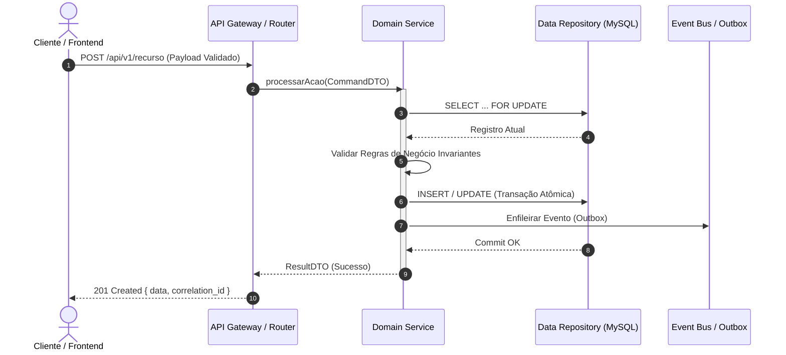

# Implementation Plan: [Nome da Feature / Tarefa]

> **Status:** `[DRAFT | IN_REVIEW | APPROVED | IN_PROGRESS | COMPLETED]`  
> **Autor(es):** `[Nome do Autor / Agente]`  
> **Data de Criação:** `YYYY-MM-DD` | **Última Atualização:** `YYYY-MM-DD`  
> **Branch:** `feature/[slug-da-tarefa]` | **Target Release:** `vX.Y.Z`  
> **Orquestrador Responsável:** `antigravity-orchestrator`  

---

## 1. Contexto do Problema & Diagnóstico (Problem Statement)

### 1.1 Diagnóstico da Situação Atual
*Descreva com clareza o estado atual do sistema, o problema identificado, gargalos ou limitações existentes.*
- **Problema Observado:** `[Descrever a falha, limitação técnica ou necessidade de evolução]`
- **Impacto no Negócio / Sistema:** `[Gargalos de latência, vulnerabilidades, perda de conversão, acoplamento]`
- **Causa Raiz Técnica:** `[Análise dos arquivos e rotinas envolvidas]`

### 1.2 Objetivos & Escopo
- **Objetivos Mensuráveis:**
  1. `[Ex: Reduzir tempo de resposta da API de conciliação para < 120ms]`
  2. `[Ex: Eliminar risco de concorrência em transações com lock pessimista]`
- **In-Scope (O que SERÁ feito):**
  - `[Item 1]`
  - `[Item 2]`
- **Out-of-Scope (O que NÃO será feito nesta iteração):**
  - `[Item 1]`
  - `[Item 2]`

---

## 2. Entrevista Socrática Grill-Me (Hard Questioning & Edge Cases)

*O método Grill-Me antecipa falhas e edge cases através de questionamento implacável antes de qualquer linha de código.*

### Rodada 1: Concorrência & Condições de Corrida
- **Pergunta Crítica:** O que acontece se duas requisições simultâneas tentarem alterar o mesmo registro no mesmo milissegundo?
- **Resposta Arquitetural:** `[Ex: Uso de SELECT ... FOR UPDATE ou lock otimista com version_id / detecção de conflito 409 Conflict]`

### Rodada 2: Falha Parcial & Resiliência
- **Pergunta Crítica:** Se o serviço de mensageria / webhook externo falhar após o commit no banco local, como o estado se recupera?
- **Resposta Arquitetural:** `[Ex: Padrão Outbox transacional com retry assíncrono idempotente e backoff exponencial]`

### Rodada 3: Casos de Borda de Dados (Null, Empty, Huge Payloads)
- **Pergunta Crítica:** Como a camada de validação reage a arrays vazios, strings com caracteres multibyte UTF-8, valores negativos ou payloads de 10MB?
- **Resposta Arquitetural:** `[Ex: Validador estrito rejeitando com 422 Unprocessable Entity antes de chegar à camada de domínio]`

### Rodada 4: Segurança & Vetores de Abuso
- **Pergunta Crítica:** Usuário autenticado mas sem permissão específica pode manipular o identificador na URL (IDOR)?
- **Resposta Arquitetural:** `[Ex: Validação de tenant_id e permissão no middleware de segurança com negação por padrão (Deny by Default)]`

### Rodada 5: Degradação & Reversibilidade (Rollback)
- **Pergunta Crítica:** Se o deploy falhar na migração de banco, como a aplicação sobrevive sem downtime?
- **Resposta Arquitetural:** `[Ex: Migrações não-destrutivas em duas etapas: expand-and-contract, backwards-compatible]`

---

## 3. Arquitetura Proposta & Design Técnico

### 3.1 Diagrama de Sequência do Fluxo



### 3.2 Modificações Estruturais & Schema de Dados
- **Novas Tabelas / Migrações:**
  ```sql
  -- Exemplo de DDL idempotente
  CREATE TABLE IF NOT EXISTS tb_exemplo (
      id INT AUTO_INCREMENT PRIMARY KEY,
      uuid CHAR(36) NOT NULL UNIQUE,
      descricao VARCHAR(255) NOT NULL,
      status VARCHAR(30) NOT NULL DEFAULT 'PENDENTE',
      created_at TIMESTAMP DEFAULT CURRENT_TIMESTAMP,
      updated_at TIMESTAMP DEFAULT CURRENT_TIMESTAMP ON UPDATE CURRENT_TIMESTAMP,
      INDEX idx_status (status)
  ) ENGINE=InnoDB DEFAULT CHARSET=utf8mb4 COLLATE=utf8mb4_unicode_ci;
  ```

---

## 4. Contrato de Handoff Backend-to-Frontend (Interface Contract)

*O contrato de handoff garante desacoplamento perfeito e previsibilidade absoluta entre equipes/workers.*

### 4.1 Endpoint: `POST /api/v1/[recurso]`

#### Request Headers:
```http
Content-Type: application/json
Authorization: Bearer <JWT_TOKEN>
X-Correlation-Id: <UUIDv4>
```

#### Request Body Schema (TypeScript / JSON):
```typescript
interface CriarRecursoRequest {
  titulo: string;               // Min 3, Max 120 caracteres
  valorUnitario: number;        // Float positivo > 0.00
  quantidade: number;           // Inteiro >= 1
  tags?: string[];              // Opcional, lista de tags alfanuméricas
}
```

#### Response 201 Created:
```json
{
  "success": true,
  "statusCode": 201,
  "timestamp": "2026-09-10T12:00:00.000Z",
  "correlationId": "f9b76ebf-6b92-49e9-b088-af8775065d80",
  "data": {
    "id": 1042,
    "uuid": "8f3b6c41-9a1d-4d7e-9081-3091df88bc11",
    "titulo": "Exemplo de Recurso",
    "valorUnitario": 99.50,
    "quantidade": 2,
    "total": 199.00,
    "status": "PROCESSADO"
  }
}
```

#### Dicionário de Códigos de Erro (HTTP & Application Errors):
| HTTP Status | Error Code | Causa | Ação Recomendada na UI |
| :--- | :--- | :--- | :--- |
| `400 Bad Request` | `MALFORMED_JSON` | JSON malformado ou tipo de dado incorreto | Exibir aviso de erro de sintaxe |
| `409 Conflict` | `DUPLICATE_RESOURCE` | Recurso já existente com mesma chave única | Sugerir edição ou renomeação |
| `422 Unproc Entity`| `VALIDATION_FAILED` | Falha em campos específicos (min/max, regex) | Destacar campos no formulário |
| `500 Internal Err` | `UNEXPECTED_ERROR` | Falha não tratada de infraestrutura | Exibir mensagem amigável e logar ID |

---

## 5. Checklist dos 6 Verifiers Gatekeepers (Auditoria Inegociável)

*Todos os 6 Verifiers devem conceder parecer `PASS` antes do merge na branch principal.*

- [ ] **1. Chief ERP Architect / Governance Verifier**
  - [ ] Alinhamento rigoroso com a Arquitetura Dual-Layer e regras de negócio.
  - [ ] Conformidade com as 4 Leis Comportamentais de Andrej Karpathy.
  - [ ] ADR redigida e linkada em caso de nova decisão estrutural.
- [ ] **2. Code Reviewer Verifier**
  - [ ] Princípios SOLID e Clean Code respeitados integralmente.
  - [ ] Nomenclatura explícita em inglês (ou convenção do projeto) sem abreviações crípticas.
  - [ ] Complexidade ciclomática < 10 por função; zero código duplicado (DRY).
- [ ] **3. Security Auditor Verifier**
  - [ ] OWASP Top 10 verificado: Zero injeção SQL (queries parametrizadas estritas / ORM seguro), sanitização de inputs.
  - [ ] Proteção contra XSS em todas as saídas e cabeçalhos de segurança HTTP.
  - [ ] RBAC validado no backend (nunca confiar apenas no bloqueio de UI).
- [ ] **4. Test Engineer Verifier**
  - [ ] Testes unitários cobrindo caminhos felizes e caminhos de exceção.
  - [ ] Testes de integração com banco de dados real em transações revertidas.
  - [ ] Cobertura de código mínima de 80% nos novos módulos.
- [ ] **5. Performance & Observability Verifier**
  - [ ] Análise de queries: Zero ocorrências de N+1 (uso de JOIN / eager loading otimizado).
  - [ ] Índices cobrindo todos os filtros de busca e ordenações recorrentes.
  - [ ] Logs estruturados com `correlation_id` e medição de latência p95.
- [ ] **6. Tech Writer / Docs Verifier**
  - [ ] Contrato de API documentado no padrão OpenAPI / Swagger.
  - [ ] Walkthrough de entrega redigido com evidências empíricas de terminal.
  - [ ] Runbook operacional atualizado com procedimentos de rollback.

---

## 6. Plano de Testes Empíricos & Prova Real (Terminal Execution)

*Testes determinísticos que devem ser executados no terminal sem simulações.*

### 6.1 Verificação de Sintaxe & Lint
```bash
# Executar no diretório raiz do projeto
npm run lint
# OU no caso de PHP:
# find src/ -name "*.php" -exec php -l {} \;
```

### 6.2 Execução da Bateria de Testes Automatizados
```bash
# Testes Unitários e Integração
npm test -- --coverage
# OU no caso de Python:
# pytest tests/ -v --cov=app
```

### 6.3 Teste de Carga / Concorrência Real
```bash
# Prova real de concorrência com 10 requisições concorrentes
npx autocannon -c 10 -d 5 http://localhost:4444/api/status
```

---

## 7. Critérios de Aceite & Fechamento da Tarefa

1. [ ] Código implementado e aderente ao plano sem dívida técnica residual.
2. [ ] Testes automatizados executados e 100% verdes (`PASS`).
3. [ ] Parecer unânime dos 6 Verifiers (`VERDICT: APPROVED`).
4. [ ] Walkthrough gerado com capturas de tela e logs de terminal.
5. [ ] Commit semântico seguindo a convenção `feat(...)`, `fix(...)`, `refactor(...)`.
